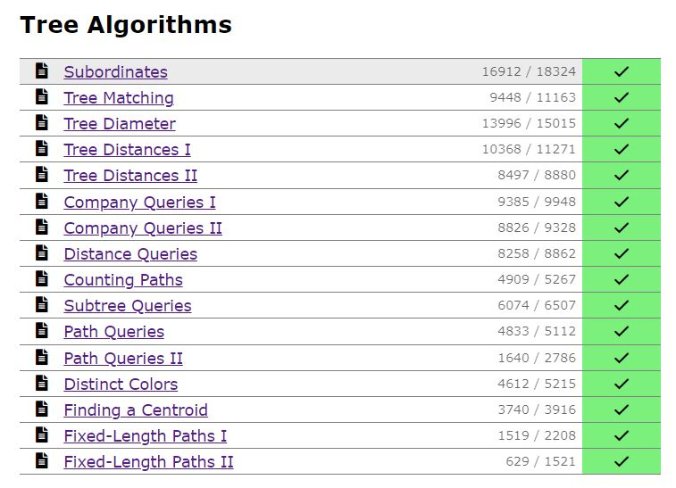

# Tree Algorithms


The special properties of trees allow us to create algorithms that are specialized for trees and work more efficiently than general graph algorithms. This chapter presents a selection of such algorithms.

Section 1 introduces basic concepts and algorithms related to trees. A central problem is finding the diameter of a tree, i.e., the maximum distance between two nodes. We will learn two linear time algorithms for solving the problem.

Section 2 focuses on processing queries on trees. We will learn to use a tree traversal array to process various queries related to subtrees and paths. After this, we will discuss methods for determining lowest common ancestors and an offline algorithm which is based on merging data structures.

Section 3 presents two advanced tree processing techniques: centroid decom- position and heavy-light decomposition.

## 1. BasicTechniques

A **tree** is a connected acyclic graph that consists of **n** nodes and **n−1** edges. Removing any edge from a tree divides it into two components, and adding any edge creates a cycle. There is always a unique path between any two nodes of a tree. The *leaves* of a tree are the nodes with only one neighbor.


As an example, consider the tree in Fig.[10.1]. This tree consists of **8 nodes** and **7 edges**, and its leaves are nodes **3, 5, 7, and 8**.

In a **rooted** tree, one of the nodes is appointed the **root** of the tree, and all other nodes are placed underneath the root. The lower neighbors of a node are called its **children**, and the upper neighbor of a node is called its **parent**. Each node has exactly one parent, except for the root that does not have a parent. The structure of a rooted tree is recursive: Each node of the tree acts as the root of a **subtree** that contains the node itself and all nodes that are in the subtrees of its children.


For example, Fig.[10.2 ] shows a rooted tree where **node 1 is the root** of the tree. The **children of node 2** are nodes 5 and 6, and the **parent of node 2** is node 1. The **subtree of node 2** consists of nodes 2, 5, 6, and 8.

### 1.1. Tree Traversal

General graph traversal algorithms can be used to traverse the nodes of a tree. However, the traversal of a tree is easier to implement than that of a general graph, because there are no cycles in the tree and it is not possible to reach a node from more than one direction.

A typical way to traverse a tree is to start a depth-first search at an arbitrary node. The following recursive function can be used:

``` cpp title="dfs.cpp" linenums="1"
void dfs(int s, int e) {
    // process node s
    for (auto u : adj[s]) 
        if (u != e) dfs(u, s); }
```

The function is given two parameters: the **current node s** and the **previous node e**. The purpose of the parameter *e* is to make sure that the search only moves to nodes that have not been visited yet.

The following function call starts the search at node *x*:
```
dfs(x, 0);
```

In the first call *e = 0*, because there is no previous node, and it is allowed to proceed to any direction in the tree.

**Dynamic Programming** can be used to calculate some information during a tree traversal. For example,the following code calculates **for each node s** a value **count[s]**: the number of nodes in its subtree. The subtree contains the node itself and all nodes in the subtrees of its children, so we can calculate the number of nodes recursively as follows:

``` cpp title="dfs2.cpp" linenums="1"
void dfs(int s, int e) {
    count[s] = 1;
    for (auto u : adj[s]) 
        if (u == e) continue; dfs(u, s);
            count[s] += count[u]; }
```

**Binary Tree Traversals** In a binary tree, each node has a left and right subtree(which may be empty), and there are three popular tree traversal orderings:

- **pre-order**: first process the root node, then traverse the left subtree, then traverse the right subtree
- **in-order**: first traverse the left subtree, then process the root node, then traverse the right subtree
- **post-order**: first traverse the left subtree, then traverse the right subtree, then pro- cess the root node


For example, in Fig.[10.3] the pre-order is [1, 2, 4, 5, 6, 3, 7], the in-order is [4, 2, 6, 5, 1, 3, 7], and the post-order is [4, 6, 5, 2, 7, 3, 1].

If we know the pre-order and in-order of a tree, we can reconstruct its exact structure. For example, the only possible tree with pre-order [1, 2, 4, 5, 6, 3, 7] and in-order [4, 2, 6, 5, 1, 3, 7] is shown in Fig.[10.3.] The post-order and in-order also uniquely determine the structure of a tree. However, if we only know the pre-order and post-order, there may be more than one tree that match the orderings.

### 1.2. CalculatingDiameters


The **diameter** of a tree is the maximum length of a path between two nodes. For example, Fig.[10.4 ] shows a tree whose diameter is 4 that corresponds to a path of length 4 between nodes 6 and 7. Note that the tree also has another path of length 4 between nodes 5 and 7.

Next we will discuss two $O(n)$ time algorithms for calculating the diameter of a tree. The first algorithm is based on dynamic programming, and the second algorithm uses depth-first searches.

**First Algorithm** A general way to approach tree problems is to first root the tree arbitrarily, and then solve the problem separately for each subtree. Our first algorithm for calculating diameters is based on this idea.


An important observation is that every path in a rooted tree has a **highest point**: the highest node that belongs to the path. Thus, we can calculate for each node *x* the length of the longest path whose highest point is *x*. One of those paths corresponds to the diameter of the tree. For example, in Fig.[10.5] node 1 is the highest point on the path that corresponds to the diameter.

We calculate for each node *x* two values:

- toLeaf(*x*): the maximum length of a path from *x* to any leaf
- maxLength(*x*): the maximum length of a path whose highest point is *x*

For example, in Fig.[10.5,] toLeaf(1) = 2, because there is a path 1 → 2 → 6, and maxLength(1) = 4, because there is a path 6 → 2 → 1 → 4 → 7. In this case, maxLength(1) equals the diameter.

Dynamic programming can be used to calculate the above values for all nodes in *O*(*n*) time. First, to calculate toLeaf(*x*), we go through the children of *x*, choose a child *c* with the maximum toLeaf(*c*) and add one to this value. Then, to calculate maxLength(*x*), we choose two distinct children *a* and *b* such that the sum toLeaf(*a*) + toLeaf(*b*) is maximum and add two to this sum. (The cases where *x* has less than two children are easy special cases.)

**Second Algorithm** Another efficient way to calculate the diameter of a tree is based on two depth-first searches. First, we choose an arbitrary node *a* in the tree and find the farthest node *b* from *a*. Then, we find the farthest node *c* from *b*. The diameter of the tree is the distance between *b* and *c*.


For example, Fig.[10.6 ] shows a possible way to select nodes *a*, *b*, and *c* when calculating the diameter for our example tree.


This is an elegant method, but why does it work? It helps to draw the tree so that the path that corresponds to the diameter is horizontal, and all other nodes hang from it Fig.[10.7]. Node *x* indicates the place where the path from node *a* joins the path that corresponds to the diameter. The farthest node from *a* is node *b*, node *c*, or some other node that is at least as far from node *x*. Thus, this node is always a valid choice for an endpoint of a path that corresponds to the diameter.

### 1.3. All Longest Paths


Our next problem is to calculate for every tree node *x* a value *maxLength(x)*: the maximum length of a path that begins at node *x*. For example, Fig.[10.8] shows a tree and its maxLength values. This can be seen as a generalization of the tree diameter problem, because the largest of those lengths equals the diameter of the tree. Also this problem can be solved in *O(n)* time.


Once again, a good starting point is to root the tree arbitrarily. The first part of the problem is to calculate for every node *x* the maximum length of a path that goes *downward* through a child of *x*. For example, the longest path from node 1 goes through its child 2 (Fig.[10.9]). This part is easy to solve in *O(n)* time, because we can use dynamic programming as we have done previously.

 

Then, the second part of theproblem is to calculate for every node *x* themaximum length of a path *upward* through it sparent *p*. For example, the longest path from node 3 goes through its parent 1 Fig.[10.10]. At first glance, it seems that we should first moveto *p* and then choose the longest path (upward or downward) from *p*. However, this *does not* always work, because such a path may go through *x* Fig.[10.11]. Still, we can solve the second part in $O(n)$ time by storing the maximum lengths of *two* paths for each node *x*:


- maxLength1(*x*): the maximum length of a path from *x* to a leaf
- maxLength2(*x*) the maximum length of a path from *x* to a leaf, in another direction than the first path

For example, in Fig.[10.11,] maxLength1(1) = 2 using the path 1 → 2 → 5, and maxLength2(1) = 1 using the path 1 → 3.

Finally, to determine the maximum length path from node *x* upward through its parent *p*, we consider two cases: If the path that corresponds to maxLength1(*p*) goes through *x*, the maximum length is maxLength2(*p*) + 1, and otherwise the maximum length is maxLength1(*p*) + 1.

https://cses.fi/problemset/

Tree Algorithms



