# Tree Algorithms

## 2. Tree Queries

In this section we focus on processing **queries** on rooted trees. Such queries are typically related to subtrees and paths of the tree, and they can be processed in constant or logarithmic time.

### 2.1. Finding Ancestors

The **k-th ancestor** of a node **x** in a rooted tree is the node that we will reach if we move **k** levels up from **x**. Let **ancestor(x, k)** denote the **k-th ancestor** of a node **x** (or 0 if there is no such an ancestor). For example, in Fig. 10.12. ancestor(2, 1) = 1 and ancestor(8, 2) = 4.

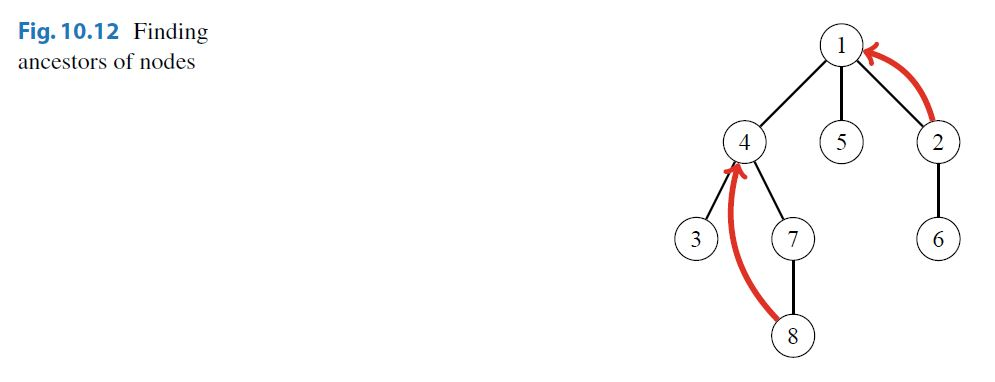

An easy way to calculate any value of **ancestor(x, k)** is to perform a sequence of**k** moves in the tree. However, the time complexity of this method is **O(k)**, which may be slow, because a tree of **n** nodes may have a path of **n** nodes.

Fortunately, we can efficiently calculate any value of **ancestor(x, k)** in **O(logk)** time after preprocessing. The idea is to first precalculate all values of **ancestor(x, k)** where **k** is a power of two. For example, the values for the tree in Fig. 10.12. are as follows:


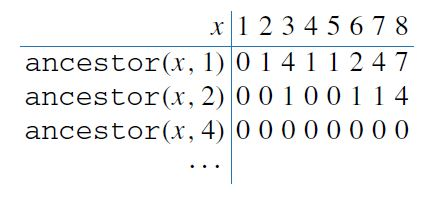


Since we know that a node always has less than **n** ancestors, it suffices to calculate **O(logn)** values for each node, and the preprocessing takes **O(n logn)** time. After this, any value of **ancestor(x, k)** can be calculated in **O(logk)** time by representing **k** as a sum where each term is a power of two.

### 2.2. Subtrees and Paths

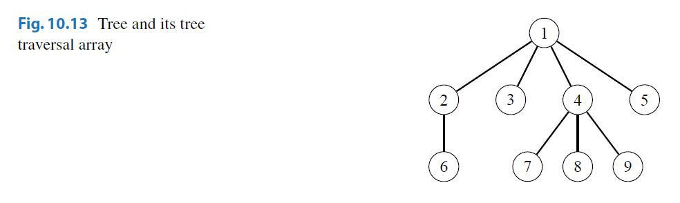

A **tree traversal array** contains the nodes of a rooted tree in the order in which a depth-first search from the root node visits them. For example, Fig 10.13. shows a tree and the corresponding tree traversal array.

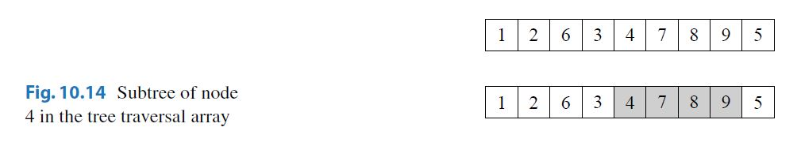

An important property of tree traversal arrays is that each subtree of a tree corresponds to a subarray in the tree traversal array such that the first element of the subarray is the root node. For example, Fig. 10.14. shows the subarray that corresponds to the subtree of node 4.

**Subtree Queries** Suppose that each node in the tree is assigned a value, and our task is to process two types of queries: updating the value of a node and calculating the sum of values in the subtree of a node. To solve the problem, we construct a tree traversal array that contains three values for each node: the identifier of the node, the size of the subtree, and the value of the node. For example, Fig. 10.15. shows a tree and the corresponding array.

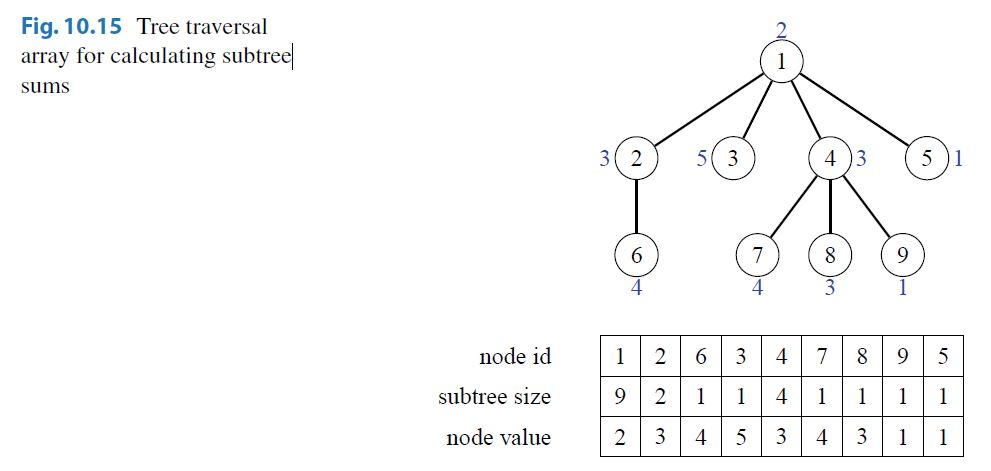

Using this array, we can calculate the sum of values in any subtree by first determining the size of the subtree and then summing up the values of the corresponding nodes. For example, Fig. 10.16. shows the values that we access when calculating the sum of values in the subtree of node 4. The last row of the array tells us that the sum of values is 3 + 4 + 3 + 1 = 11.

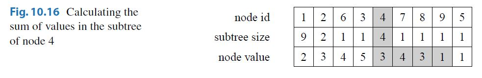

To answer queries efficiently, it suffices to store the last row of the array in a binary indexed or segment tree. After this, we can both update a value and calculate the sum of values in **O(log n)** time.

**Path Queries** Using a tree traversal array, we can also efficiently calculate sums of values on paths from the root node to any node of the tree. As an example, consider a problem where our task is to process two types of queries: **updating** the value of a node and **calculating** the sum of values on a path from the root to a node.

To solve the problem, we construct a tree traversal array that contains for each node its identifier, the size of its subtree, and the sum of values on a path from the root to the node Fig. 10.17. When the value of a node increases by **x**, the sums of all nodes in its subtree increase by **x**. For example, Fig. 10.18 shows the array after increasing the value of node 4 by 1.

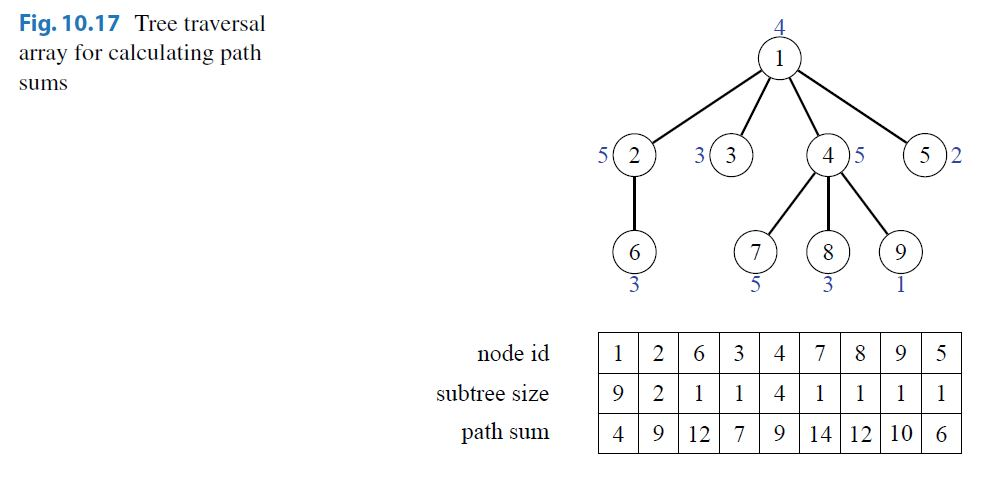
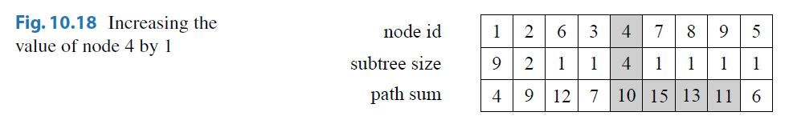

To support both the operations, we need to be able to increase all values in a range and retrieve a single value. This can be done in **O(logn)** time using a binary indexed or segment tree and a difference array.

### 2.3. **Lowest Common Ancestors**

The **lowest common ancestor** of two nodes of a rooted tree is the lowest node whose subtree contains both the nodes. For example, in Fig. 10.19 the lowest common ancestor of nodes 5 and 8 is node 2.

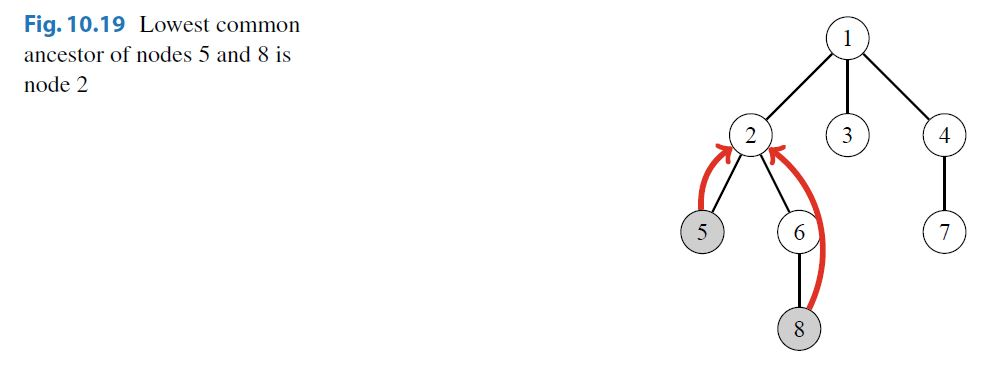

A typical problem is to efficiently process queries that require us to find the lowest common ancestor of two nodes. Next we will discuss two efficient techniques for processing such queries.

**First Method** Since we can efficiently find the **k-th ancestor** of any node in the tree, we can use this fact to divide the problem into two parts. We use two pointers that initially point to the two nodes whose lowest common ancestor we should find.

First, we make sure that the pointers point to nodes at the same level in the tree. If this is not the case initially, we move one of the pointers upward. After this, we determine the minimum number of steps needed to move both pointers upward so that they will point to the same node. The node to which the pointers point after this is the lowest common ancestor. Since both parts of the algorithm can be performed in *O*(log*n*) time using precomputed information, we can find the lowest common ancestor of any two nodes in *O*(log*n*) time.

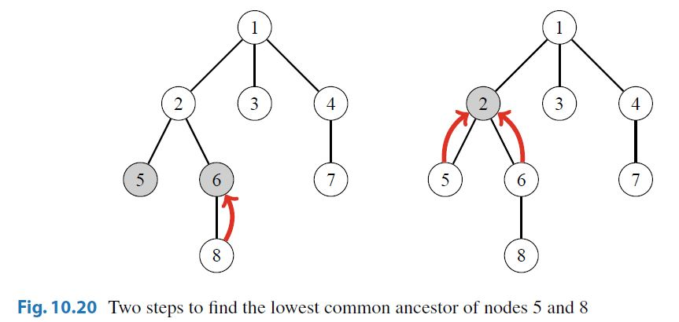

Figure 10.20. shows how we can find the lowest common ancestor of nodes 5 and 8 in our example scenario. First, we move the second pointer one level up so that it points to node 6 which is at the same level with node 5. Then, we move both pointers one step upward to node 2, which is the lowest common ancestor.

**Second Method** Another way to solve the problem, proposed by Bender and Farach-Colton, is based on an extended tree traversal array, sometimes called an **Euler tourtree**. To construct the array, we go through the tree nodes using depth-first search and add each node to the array *always* when the depth-first search walks through the node (not only at the first visit). Hence, a node that has *k* children appears *k + 1* times in the array, and there are a total of *2n − 1* nodes in the array. We store two values in the array: the identifier of the node and the depth of the node in the tree. Figure 10.21. shows the resulting array in our example scenario.

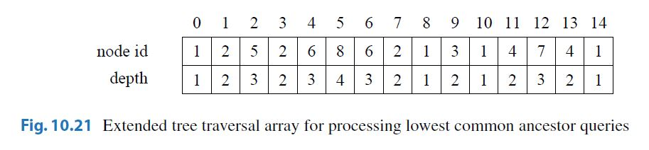

Now we can find the lowest common ancestor of nodes *a* and *b* by finding the node with the *minimum* depth between nodes *a* and *b* in the array. For example, Fig 10.22. shows how to find the lowest common ancestor of nodes 5 and 8. The minimum depth node between them is node 2 whose depth is 2, so the lowest common ancestor of nodes 5 and 8 is node 2.

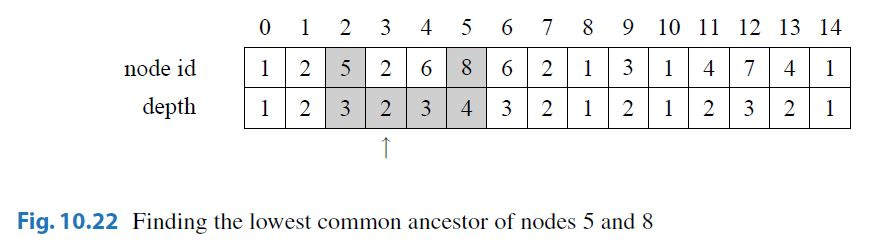


Note that since a node may appear several times in the array, there may be multiple ways to choose the positions of nodes *a* and *b*. However, any choice correctly determines the lowest common ancestor of the nodes.

Using this technique, to find the lowest common ancestor of two nodes, it suffices to process a range minimum query. The usual way is to use a segment tree to process such queries in *O*(log*n*) time. However, since the array is static, we can also process queries in *O(1)* time after an *O(n logn)* time preprocessing.

**Calculating Distances** Finally, consider the problem of processing queries where we need to calculate the distance between nodes *a* and *b* (i.e., the length of the path between*a* and *b*). It turns out that this problem reduces to finding the lowest common ancestor of the nodes. First, we root the tree arbitrarily. After this, the distance of nodes *a* and *b* can be calculated using the formula

depth(*a*) + depth(*b*) − 2 ·depth(*c*),

where *c* is the lowest common ancestor of *a* and *b*.

For example, to calculate the distance between nodes 5 and 8 in Fig. 10.23. we first determine that the lowest common ancestor of the nodes is node 2. Then, since the depths of the nodes are depth(5) = 3, depth(8) = 4, and depth(2) = 2, we conclude that the distance between nodes 5 and 8 is 3 + 4 − 2 ·2 = 3.

### 2.4. Merging Data Structures

So far, we have discussed *online* algorithms for tree queries. Those algorithms are able to process queries one after another in such a way that each query is answered before receiving the next query. However, in many problems, the online property is not necessary, and we may use **offline** algorithms to solve them. Such algorithms are given a complete set of queries which can be answered in any order. Offline algorithms are often easier to design than online algorithms.

One method to construct an offline algorithm is to perform a depth-first tree traversal and maintain data structures in nodes. At each node *s*, we create a data structure *d[s]* that is based on the data structures of the children of *s*. Then, using this data structure, all queries related to *s* are processed.

As an example, consider the following problem: We are given a rooted tree where each node has some value. Our task is to process queries that ask to calculate the number of nodes with value *x* in the subtree of node *s*. For example, in Fig. 10.24. the subtree of node 4 contains two nodes whose value is 3.

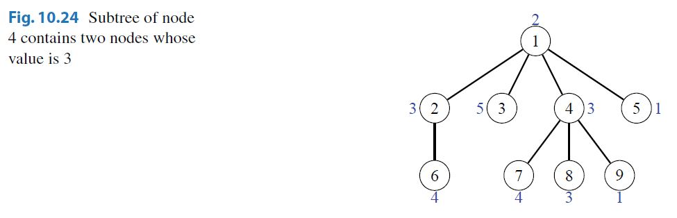

In this problem, we can use map structures to answer the queries. For example, Fig. 10.25. shows the maps for node 4 and its children. If we create such a data structure for each node, we can easily process all given queries, because we can handle all queries related to a node immediately after creating its data structure.

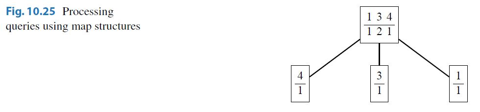

However, it would be too slow to create all data structures from scratch. Instead, at each node *s*, we create an initial data structure *d[s]* that only contains the value of *s*. After this, we go through the children of *s* and **merge** *d[s]* and all data structures *d[u]* where *u* is a child of *s*. For example, in the above tree, the map for node 4 is created by merging the maps in Fig. 10.26. Here the first map is the initial data structure for node 4, and the other three maps correspond to nodes 7, 8, and 9.

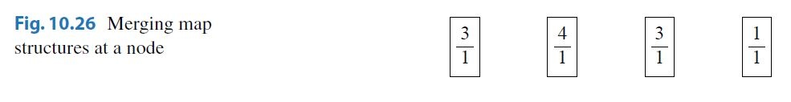

The merging at node *s* can be done as follows: We go through the children of *s* and at each child *u* merge *d[s]* and *d[u]*. We always copy the contents from *d[u]* to *d[s]*. However, before this, we *swap* the contents of *d[s]* and *d[u]* if *d[s]* is smaller than *d[u]*. By doing this, each value is copied only *O(logn)* times during the tree traversal, which ensures that the algorithm is efficient.

To swap the contents of two data structures *a* and *b* efficiently, we can just use the following code:

```
swap(a,b);
```
It is guaranteed that the above code works in constant time when *a* and *b* are C++ standard library data structures.

