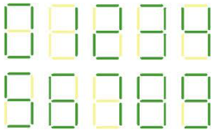
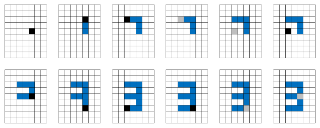

---
hide:
  - toc
---

# 2 - Crtanje brojeva

#  "Zadatak"

| Vremensko ograničenje | Memorijsko ograničenje |
|:-:|:-:|
| 100ms | 16MB |

Anitica je naučila da crta ali ne i da piše, no za Zimske olimpijske igre želi da bodri naše ekipe tako što će ispisati njihova imena na snegu. Za početak želi da nauči da piše cifre, a sledeće nedelje će raditi na slovima. Načula je da je najlakši način da to nauči je da prvo crta cifre crticama, slično kao na digitalnom displeju. Za tu svrhu je izabrala papir na kvadratiće kako bi lakše povlačila crtice.

Na početku Anitica spusti vrh olokve na  bilo koji čvor na papiru. Nakon toga prati komande kako bi iscrtala cifre, pri čemu komande mogu biti:

* 'U' - pomerajnje oloke gore za jednu crticu
* 'L' - pomeranje olovke levo za jednu crticu
* 'D' - pomeranje olovke dole za jednu crticu
* 'R' - pomeranje olokve desno za jednu crticu
* '_' - spuštanje olovke na papir
* '^' - podizanje olokve sa papira.

Kako bi joj olakšali proveru rezultata, rešili smo da napišemo program koji za zadatu listu komandi vraća cifru koje one ispisuju. Izgled cifara na digitalnom displeju:



## Ulaz
Prvi red standardnog ulaza sadrži prirodni broj $N$, koji predstavlja broj cifara koje treba proveriti. Narednih $N$ redova sadrže po jedan string koji opisuje niz komandi. Komande za svaku cifru se izvršavaju redosledom kojim su zadate.

## Izlaz
U prvom i jedinom redu standardnog izlaza štampati niz od $N$ cifara, koje su odvojene po jednim znakom razmaka. Cifre predstavljaju rezultate nizova komandi u redusledu iz ulaza.

## Primer 1
### Ulaz
```
2
UL^D_RDLR^U
D^LLDRR_U
```

### Izlaz
```
3 1
```

## Ograničenja
* $1\leq N \leq 10$.
* Dužina niza komandi, odnosno stringova iz ulaza, nije veća od $1000$.
* Ishod svakog niza komandi predstavlja validnu cifru. Ulaz će uvek sadržati regularni niz komandi.
* Izgled cifara je dat na slici u tekstu problema.


#  "Rešenje"

| Autor | Tekst i test primeri | Analiza rеšenja | Testiranje |
|:-:|:-:|:-:|:-:|
| Andreja Ilić | Andreja Ilić | Andreja Ilić | Dušan Zdravković |

Na prvi pogled, odnosno u našem slučaju na prvo čitanje, problem deluje jednostavno. Međutim, pri malo detaljnijoj analizi ili pri pokušaju implementacije mogu se uočiti određeni specijalni slučajevi koji nam, ukoliko se o njima dobro ne razmisli, mogu “zagorčati život“.

Kako je ograničenje za dužinu niza komandi malo - **simulacija se prosto nameće**. Nakon simulacije imamo “sliku” koju treba uporediti sa slikama svih cifara. Kao rezultat vraćamo cifru čija se slika poklopila sa slikom koju smo dobili simulacijom. Zato se postavlja pitanje kako izvršiti samu simulaciju? U zadatku Anitica crta po ivicama rešetke, tako da ukoliko bi papir modelirali matricom potrebno je naći način markiranja ivica a ne polja matrice. Samo markiranje i ne predstavlja veliki problem, ali kasnije moramo tu sliku upoređivati sa slikama drugih cifara, što može biti problem.

Zato se možemo poslužiti trikom da papir modeliramo matricom, ali da se potez simulira tako što markiramo tri polja matrice (u datom smeru). Naime, u svakom trenutku pamtimo trenutnu poziciju na kojoj se nalazi olovka. Označimo koordinate trenutne pozicije sa $(currentX, currentY)$. Ukoliko je, na primer, naredna komanda povlačenje olovke desno, tada polja $(currentX, currentY)$, $(currentX, currentY+1)$ i $(currentX, currentY+2)$ treba obojiti ukoliko je olovka na papiru. Za pamćenje stanja olovke, da li je na papriru ili u vazduhu, možemo koristiti običnu boolean promenjivu koja menja vrednosti kada naiđe na odgovarajuće komande.

Simulacija primera sa papira. Crno polje predstavalja poziciju olovke kada je ona spuštena, a sivo polje kada je u vazduhy:



Kako znamo da će na kraju iscrtana slika predstavljati neku od deset cifara (uslov zadatka), naša simulacija ne može “nacrtati” sliku dimenzija većih od $6\times 3$. Nažalost, kako iz samog problema ne znamo tačnu poziciju iz koje Anitica kreće da crta (primera radi ne znamo da ona uvek kreće iz gornjeg-desnog ugla), našu simulaciju možemo započeti iz sredine matrice. Ovde se krije jedan mali problem. Naime, ukoliko samu simulaciju vršimo tako što se uvek krećemo po poljima matrice, onda matrica mora biti veoma velika. Ali mi znamo da je deo matrice koji je nama bitan, deo na kome su oboje polja, ne može biti veći od gore navedene dimenzije, mi onda možemo vršiti simulaciju samo kada je olovka na papiru. Kada je olovka u vazduhu mi možemo samo da menjamo vrednosti trenutne pozicije u matrici. U trenucima kada je olovka na papiru, pored menjanja trenutne pozicije, polja kroz koja prolazimo treba markirati (odnosno obojiti).

Sada znamo da je potrebno definisati malu matricu koja će nam služiti za simulaciju, ali se postavlja pitanje kolika dimenzija te matrica je potrebna? Gore smo spomenuli da mi ne znamo u kome smeru će Anitica crtati cifre, tako da kada krenemo simulaciju iz sredine matrice, ne znamo da li će Anitica nastaviti crtanje dole desno ili gore levo ili samo dole. Zbog toga možemo definisati matricu koja može prihvatiti cifre u svim pravcima. Iz ove analize možemo zaključiti da je dovoljno matricu definisati sa dimenzijama $(3+3)\times (6+6)$.

Nažalost, u ovoj analizi nam se podkrao još jedan specijalni slučaj – šta ako prva komanda predstavlja podizanje olovke u vazduh. Ukoliko krenemo slimulaciju odmah, može se desiti da prvi trenutak kada Anitica spisti olovku bude mnogo izvan opsega naše matrice. Ono što mi znamo jeste da čim povuče prvu crticu, onda će ostatak slike biti blizu te crtice. Zato je na početku potretrebno zanemariti deo pre prve crte koju povuče Anitice. Ovo zapravo predstavlja početni deo niza komndati koji se dešava “u vazduhu”.

Slike cifara:
```
###   #   ###  ###  # #  ###  ###  ###  ###  ###
# #   #     #    #  # #  #    #      #  # #  # #
# #   #   ###  ###  ###  ###  ###    #  ###  ###
# #   #   #      #    #    #  # #    #  # #    #
###   #   ###  ###    #  ###  ###    #  ###  ###
```
Na kraju simulacije imamo stanje matrice iz koje treba prepozanti cifru. Na početku možemo definisati izglede svih deset cifara i njihove slike ubaciti u kod. Sliku koju je nacrtala Anitica možemo dobiti tako što iz matrice izvučemo onaj deo koji je veličine $6\times 3$ i koji sadrži sliku (ostali deo slike nam nije potreban). Kada sve ove vrednosti imamo, možemo uporediti navedeni deo podmatrice sa svim ciframa i vratiti onu čija se slika poklapa.

## Generalizacija
Dve generalizacije ovogo problema su bile razmatrane za ovo takmičenje. Prva je da **cifre koje crta Anitica mogu biti sklirane**, drugim rečima onda može nacrtana broj jedan veličine 15 uzastopnih crtica na gore ili na dole. Ovde bi prepoznavanje samih cifara bilo dosta komplikovanije, jer nije dovoljno ipitivati samo puku jednakost dve podmatrice.

Druga generalizacije je bila ukoliko cifre nisu skalirane, ali **Anitica može da pogreši i da nacrta bilo šta**. Ovo bi upoređivanje bilo identično kao i u početnoj verziji problema ali bi bilo potrebno ubaciti još neke specijalne slučajeve u anazizu. Ovi specijalni slučajevi bi služili da nam pomognu u odluci da li da nastvimo simulaciju ili ne – na primer ukoliko Anitica počne da šara po papiru svuda čime se dobija velika slika koja svakako nije cifra.

``` cpp title="02_crtanje_brojeva.cpp" linenums="1"
/* ===============================================================
Problem:		Crtanje brojeva
Takmicenje:		Kvalifikacije 01, februar 2014
Autor:			Andreja Ilic, andrejko.ilic@gmail.com
=============================================================== */
#include <stdio.h>
#include <string.h>

#define MAX_N 11
#define MAX_LEN 10005
#define M 10

int n, digit[MAX_N];
char comands[MAX_LEN];
bool board [M][M];

// Binarna reprezentacija cifara 0 - 9. Svaka cifra je predstavljena matricom 5 x 3 na sledeci nacin
//
//  ###   #   ###  ###  # #  ###  ###  ###  ###  ###
//  # #   #     #    #  # #  #    #      #  # #  # #
//  # #   #   ###  ###  ###  ###  ###    #  ###  ###
//  # #   #   #      #    #    #  # #    #  # #    #
//  ###   #   ###  ###    #  ###  ###    #  ###  ###
//  
// pri cemu znak # oznacava 1 u binarnom zapisu, a space oznacava 0. Na ovaj nacin je svaka cifra
// opisana sa 15o bitnim prirodnim brojema, koji se dobija kada se data matrica prebaci u niz, 
// prebacivanjem vrste po vrste. Primera radi broj nula (111101101101111)_2 = (31599)_10
int digits [10] = { 31599, 18724, 29671, 29647, 23497, 31183, 31215, 29257, 31727, 31695};

int solve()
{
	// Inicijalizacija matrice na praznu matricu
	for(int i = 0; i < M; i++)
		for(int j = 0; j < M; j++)
			board [i][j] = false;

	// Polazimo iz sredista matrice, pri cemu je na pocetku olovka spustena
	int currentX = M / 2, currentY = M / 2;
	bool pencilDown = true;
	
	// Preskacemo pocetak komandi sve dok naidjemo na prvu crticu koju povlacimo
	int startIndex = 0;
	while (!(pencilDown && comands[startIndex] != '^' && comands[startIndex] != '_'))
	{
		if (comands[startIndex] == '^')
			pencilDown = false;
		if (comands[startIndex] == '_')
			pencilDown = true;
		startIndex++;
	}

	// Simulacija crtanja
	for(int index = startIndex; index < strlen(comands); index++)
	{
		switch(comands[index])
		{
		case '_':
			pencilDown = true;
			break;
		case '^':
			pencilDown = false;
			break;
		case 'U':
			if (pencilDown)
				board [currentX][currentY] = board [currentX - 1][currentY] = board [currentX - 2][currentY] = true;
			currentX = currentX - 2;
			break;
		case 'D':
			if (pencilDown)
				board [currentX][currentY] = board [currentX + 1][currentY] = board [currentX + 2][currentY] = true;
			currentX = currentX + 2;
			break;
		case 'L':
			if (pencilDown)
				board [currentX][currentY] = board [currentX][currentY - 1] = board [currentX][currentY - 2] = true;
			currentY = currentY - 2;
			break;
		case 'R':
			if (pencilDown)
				board [currentX][currentY] = board [currentX][currentY + 1] = board [currentX][currentY + 2] = true;
			currentY = currentY + 2;
			break;
		default:
			break;
		}
	}

	// Nalazimo prvo polje koje je obojeno olovkom. Ono definise podmatricu koja zapravo sadrzi broj.
	// (ovo polje je gornje levo polje podmatrice).
	int startX = -1, startY = -1;
	for (int i = 0; i < M && startX == -1; i++)
		for (int j = 0; j < M && startX == -1; j++)
			if(board[i][j])
			{
				startX = i;
				startY  = j;
			}

	// Za svaku od cifara proveravamo da li se matrica cifre poklapa sa podmatricom
	for(int digit = 0; digit < 10; digit++)
	{
		bool match = true;

		for(int i = 0; i < 5; i++)
		{
			for(int j = 0; j < 3; j++)
			{
				int index = 14 - (i * 3 + j);
				bool state = (digits[digit] & (1 << index)) != 0;
				if (state != board [startX + i][startY + j])
				{
					match = false;
				}
			}
		}

		if (match)
			return digit;
	}

	// Kako su nizovi komandi regularni ovo se nikada nece dostici
	return -1;
}

int main()
{
	scanf("%d", &n);
	for (int i = 0; i < n; i++)
	{
		scanf("%s", comands);
		digit[i] = solve();
	}
	for (int i = 0; i < n; i++)
		printf("%d ", digit [i]);
	printf("\n");

	return 0;
}
```
