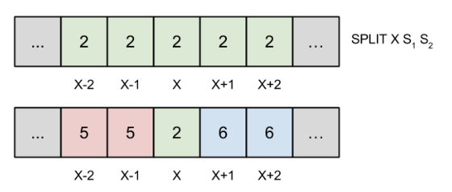

---
hide:
  - toc
---

# 3 - Split

#  "Zadatak"

| Vremensko ograničenje | Memorijsko ograničenje |
|:-:|:-:|
| 1000ms | 32MB |

Nakon uspešnog napada na bazu podataka za igricu ”Flappy Bird” od strane malog Perice, komisija je uvela jake bezbednosne mere da spreči ponovni napad takve vrste. Perica je zato pribegao planu B – razvoju bota koji bi, nakon što učita sve generisane pozicije otvora cevi, igrao igricu umesto njega i tako osvojio velike količine bodova. Na njegovu veliku žalost, komisija je ovoga puta bila korak ispred – unapredila je nepredvidljivost igrice tako da usred jedne igre može da se promeni **program** koji generiše cevi na nekom delu mape.

Međutim, ovaj sistem je ipak dovoljno predvidljiv pa se Peričin bot može prilagoditi. Pre svega, svaki program se može identifikovati nekim stringom. U početku imamo jedan program na celoj mapi veličine (dužine) $N$, i moguće je u bilo kojem trenutku izvršiti **split** operaciju na nekom polju; efekat ove operacije je da to polje zadržava svoj trenutni program, dok sva polja levo i sva polja desno koja su **obuhvaćena istim programom** dobijaju nove programe.

Peričinog bota će u određenim momentima tokom izvršavanja igrice zanimati koji program se koristi na nekom određenom polju. Na vama je da efikasno odgovorite na njegova pitanja.

## Ulaz
U prvom redu standardnog ulaza nalaze se dva cela broja, $N$ i $Q$, koji predstavljaju veličinu mape i broj upita, redom. U sledećem redu se nalazi string $S$ koji predstavlja početni program koji se izvršava na celoj mapi. U narednih $Q$ redova se nalazi po jedna komanda koja može imati jedan od sledeća dva oblika:

* `SPLIT X S1 S2` : izvršiti split na polju $X$; polja levo, obuhvaćena istim programom kao i polje $X$, dobijaju program $S_1$ a polja desno, obuhvaćena istim programom kao i polje $X$, program $S_2$.
* `QUERY X` : upit koji pita koji program se trenutno izvršava na polju $X$.

## Izlaz
Za svaku komandu tipa `QUERY` ispisati u novom redu string koji predstavlja traženi program.

## Primer 1
### Ulaz
```
6 6
picsel
SPLIT 3 petarv duxserbia
SPLIT 5 sasav nikolaj
QUERY 1
QUERY 3
QUERY 5
QUERY 6
```

### Izlaz
```
petarv
picsel
duxserbia
nikolaj
```

## Objašnjenje primera
U početku, program `picsel` deluje na celoj mapi; posle prve i druge split operacije, mapa se menja na sledeći način:

`[petarv, petarv, picsel, duxserbia, duxserbia, duxserbia]`

`[petarv, petarv, picsel, sasav, duxserbia, nikolaj]`

Odgovori na upite onda očigledno slede iz konačne mape.

## Ograničenja

* $1 \leq N, Q \leq 10^5$.
* $1 \leq X \leq N$.
* $1 \leq |S|, |S_1|, |S_2| \leq 50$. Stringovi će se sastojati samo od malih slova engleskog alfabeta.
* Svi nazivi programa će biti međusobno različiti.

Test primeri su podeljeni u dve disjunktne grupe:

* U test primerima vrednim $50$ poena važi $1 \leq N, Q \leq 1000$.
* U test primerima vrednim $50$ poena nema dodatnih ograničenja.


#  "Rešenje"

| Autor | Tekst i test primeri | Analiza rеšenja | Testiranje |
|:-:|:-:|:-:|:-:|
| Petar Veličković | Petar Veličković | Petar Veličković | Boris Grubić |

Problem Split je jedan od težih problema na drugim Kvalifikacijama, i da bi se potpuno rešio potrebno je znanje naprednijih struktura podataka (nivo Srpske Informatičke Olimpijade). Inspiracija za zadatak je potekla od zadatka Žetoni sa SIO 2012. kada je autor (tadašnji takmičar) upotrebio sličnu metodu ”splitova” da bi rešio zadatak.

Zadatak se može prevesti u formalni oblik na više načina; evo jedne moguće interpretacije:

> Zadata je funkcija sa skupa prirodnih brojeva na skup stringova, $f: N\rightarrow \Sigma$, tako da u početku važi $f(n)=S$ za sve $n$. Split operacijom na poziciji $X$ sa stringovima $S_1$ u $S_2$ funkcija $f$ se menja u funkciju $f'$ tako da važi:

> * $f'(x) = S_1$ ako $x < X \land f(x)=f(X)$.
> * $f'(x) = S_2$ ako $x>X \land f(x)=f(X)$.
> * $f'(x) = f(x)$ inače.

> Potrebno je odrediti f(n) svaki put kada se pozove query operacija na poziciji n.

Zadatak se može rešiti tako što održavamo strukturu **intervala**, gde za svaki interval pamtimo neki jedinstveni identifikator, levu i desnu granicu, kao i string koji označava program koji se trenutno izvršava na tom intervalu. U početku postoji samo jedan interval, $I_0$, tako da važi: $I_0.L = 1$, $I_0.R = N$, $I_0.prog=S$. Neophodno je pamtiti koji je poslednji napravljeni interval.

U isto vreme treba održavati i niz $map$, tako da $map[n]=x$ znači da se polje $n$ trenutno nalazi unutar intervala $I_x$. Naravno, u početku je $map[i]=0$ za sve $i$. Održavanjem ovog niza dobijamo jednostavan odgovor na sve $QUERY$ $X$ upite; dovoljno je vratiti $I_{map(X)}.prog$.

Posmatrajmo sada kako održavati *map* tokom neke split operacije:

Na slici ispod se nalazi niz *map*, pre i posle split operacije na polju $x$. Polja u intervalu $[x-2, x+2]$ su pod kontrolom intervala $I_2$, a poslednji do sada napravljeni interval je $I_4$.



Split operacija kreira dva nova intervala, $I_5$ i $I_6$, i dodeljuje im sledeće parametre:

$$
I_5.L=I_2.L,     I_5.R=x-1,     I_5.prog=S_1;
$$

$$
I_6.L=x+1,     I_6.R=I_2.R,     I_6.prog=S_2.
$$

Takođe se niz $map$ ažurira kao na slici, i $I_2.L = I_2.R = x$.

Naivno rešenje koje održava niz *map* tako što pri svakoj split operaciji prepisuje sve njegove članove obuhvaćene nekim intervalom nije dovoljno efikasno i donosi oko $50$ bodova. Da bismo zakoračili ka kompletnom rešenju ne smemo eksplicitno čuvati ovaj niz u memoriji; umesto toga održavaćemo niz $pmap$, gde će $map[n]$ biti suma svih elemenata niza $pmap$ od prvog do $n$-tog; formalnije:

$$
map[n]=\sum_{i=1}^{n} pmap[i]
$$

Očigledno je da u početku $pmap[x]=0$ za sve $x$. Primetimo da, ukoliko želimo da na nekom intervalu $[l, r]$ povećamo sve vrednosti niza $map$ za $k$, dovoljno je uraditi:

$$
pmap[l] = pmap[l] + k
$$

$$
pmap[r] + 1 = pmap[r+1] - k
$$

Nazvaćemo ovu metodu $update(l,  r,  k)$. Moguće je izvršiti split operaciju sa konstantnim brojem pozivanja ove metode; ako pretpostavimo da želimo izvršiti split operaciju na polju $x$, da je $I_{id}$ interval koji obuhvata $x$, i da je $I_w$ poslednji napravljeni interval do sad, split operacija se može opisati sledećim algoritmom:

* Napraviti intervale $I_{w+1}$ i $I_{w+2}$ kao što je ranije opisano.
* Ažurirati $pmap$ tako da $map[n]=0$ za sve $n \in I_{id} \rightarrow update(I_{id}.L,  I_{id}.R,  -id)$.
* Ažurirati $pmap$ tako da $map[n] = w+1$ za sve $n \in I_{w+1} \rightarrow update(I_{id}.L, x-1, w+1)$.
* Ažurirati $pmap$ tako da $map[n] = w+2$ za sve $n \in I_{w+2} \rightarrow update(x+1,  I_{id}.R,  w+2)$.
* Ažurirati $pmap$ tako da $map[n] = id$ za $n=x \rightarrow update(x,  x,  id)$.
* Ažurirati interval $I_{id}$ kao što je ranije opisano.

Napomenimo da se neki od ovih koraka trebaju promeniti ili preskočiti u slučaju da je polje $x$ na levoj ili desnoj ivici intervala $I_{id}$. Sa trenutnom implementacijom operacije $update$, koja radi u složenosti $O(1)$, neophodno je svaki put ponovo sumirati sve neophodne elemente niza $pmap$ kada imamo komandu $QUERY$; ovo je složenosti $O(n)$, tako da je pristup i dalje neefikasan i donosi oko $60$ bodova.

Da bismo efikasnije određivali sume prvih $n$ elemenata niza $pmap$, neophodno je koristiti strukturu koja se zove *Fenvikovo stablo (Fenwick tree / Binary Indexed Tree / BIT)* koje nam omogućava da računamo ove sume u vremenskoj složenosti $O(log n)$  po cenu toga da i $update$ operacija mora biti složenosti $O(log n)$. Ovo nam daje ukupnu vremensku složenost $O(N+Q\cdot log N)$, koja je dovoljna za dobijanje $100$ bodova.

``` cpp title="03_split.cpp" linenums="1"
/*
 Author: Petar 'PetarV' Velickovic
 Task: Split
*/

#include <stdio.h>
#include <math.h>
#include <string.h>
#include <time.h>
#include <iostream>
#include <vector>
#include <list>
#include <string>
#include <algorithm>
#include <queue>
#include <stack>
#include <set>
#include <map>
#include <complex>

#define MAX_N 100005

#define DPRINTC(C) printf(#C " = %c\n", (C))
#define DPRINTS(S) printf(#S " = %s\n", (S))
#define DPRINTD(D) printf(#D " = %d\n", (D))
#define DPRINTLLD(LLD) printf(#LLD " = %lld\n", (LLD))
#define DPRINTLF(LF) printf(#LF " = %.5lf\n", (LF))

using namespace std;
typedef long long lld;
typedef unsigned long long llu;

int n, q;
char frst[55];
char kom[10];
int x;
char s1[55], s2[55];

struct Range
{
    int L, R;
    string S;
};
vector<Range> Rs;
int idd = 0;

int bit[MAX_N];

inline void update(int x, int val)
{
    while (x <= n)
    {
        bit[x] += val;
        x += (x & -x);
    }
}

inline int read(int x)
{
    int ret = 0;
    while (x > 0)
    {
        ret += bit[x];
        x -= (x & -x);
    }
    return ret;
}

inline void split(int x, string sL, string sR)
{
    int idx = read(x);
    
    int L = Rs[idx].L;
    int R = Rs[idx].R;
    
    // Reduce [L..R] to 0
    update(L, -idx);
    if (R < n) update(R+1, idx);
    
    // Convert [L..x-1] to idL
    if (L < x)
    {
        int idL = ++idd;
        
        update(L, idL);
        update(x, -idL);
        
        Range Rl;
        
        Rl.L = L;
        Rl.R = x-1;
        Rl.S = sL;
        
        Rs.push_back(Rl);
    }
    
    // Convert [x+1..R] to idR
    if (x < R)
    {
        int idR = ++idd;
        
        if (x < n) update(x+1, idR);
        if (R < n) update(R+1, -idR);
        
        Range Rr;
        
        Rr.L = x+1;
        Rr.R = R;
        Rr.S = sR;
        
        Rs.push_back(Rr);
    }
    
    // Convert [x..x] to idx
    update(x, idx);
    if (x < n) update(x+1, -idx);
    
    Rs[idx].L = Rs[idx].R = x;
}

inline void debug()
{
    for (int i=1;i<=n;i++)
    {
        printf("%d ", read(i));
    }
    printf("\n");
}

int main()
{
    scanf("%d%d%s", &n, &q, frst);
    
    Range R;
    R.L = 1, R.R = n;
    R.S = frst;
    Rs.push_back(R);
    
    while (q--)
    {
        scanf("%s", kom);
        if (kom[0] == 'S')
        {
            scanf("%d%s%s", &x, s1, s2);
            split(x, s1, s2);
        }
        else if (kom[0] == 'Q')
        {
            scanf("%d", &x);
            printf("%s\n", Rs[read(x)].S.c_str());
        }
    }
    return 0;
}
```
