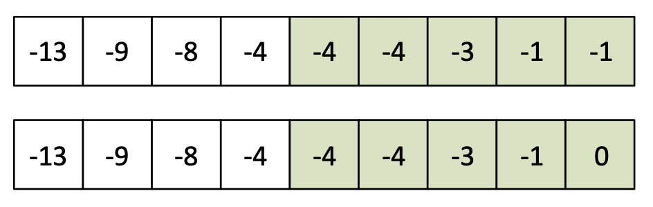

---
hide:
  - toc
---

# A1 - Polaganje ispita

#  "Zadatak"

| Vremensko ograničenje | Memorijsko ograničenje |
|:-:|:-:|
| 300ms | 64MB |

Anitica je ovog vikenda polagala ispit iz Opšte-narodne medicine i umetnosti. Princip polaganja ovog ispita je drugačiji od ostalih: **na ispitu student izvlači $N$ pitanja, odgovara na svako od njih**, a krajnji broj bodova se dobija sumom bodova najboljih $K$ pitanja. Svako pitanje vredi isti broj bodova. Kako je ovo jako bitan ispit, ukoliko student počne da “lupa gluposti” može osvojiti i negativan broj bodova na  nekom od pitanja.

Anitica je uspešno položila ispit ali nije zadovoljna svojim brojem bodova. Ovo je njoj jako bitno, jer nije uspela da dobije ocenu potrebnu da u fakultetskoj poslastičari osvoji besplatne čvarke i kavurmu kao nagradu. Zato je rešila da nađe drugi način ocenjivanja kako bi dobila veći broj bodova. Način koji je odabrala je da umesto $K$ najboljih odgovora, **može da izabere bilo kojih  $K$ pri čemu je ukupan broj bodova jednak proizvodu bodova osvojenih na izabranih $K$ pitanja**.

Pomozite Anitici da utvrdi koji je najveći broj bodova koji ona može da osvoji preko svog načina bodovanja ispita.

## Ulaz
U prvom redu standardnog ulaza nalaze se dva prirodna broja, odvojena jednim znakom razmaka, $N$ i $K$, koji označavaju ukupan broj pitanja i broj pitanja koji ulaze u računanje broja bodova za ispit. Drugi red ulaza sadrži $N$ celih brojeva, odvojenih po jednim znakom razmaka, koji predstavljaju broj bodova za svako od izvučenih pitanja.

## Izlaz
Prvi i jedini red standardnog izlaza treba da sadrži $K$ celih brojeva – vrednosti pitanja koje treba izabrati za računanje broja bodova po metodi Anitice. Pitanja štampati u proizvoljnom redosledu. Ukoliko ima više rešenja, štampati bilo koje.

## Primer 1
### Ulaz
```
7 5
-1 4 2 3 1 5 -3
```

### Izlaz
```
-1 4 3 5 -3
```

## Objašnjenje primera
Proizvod izabranih pitanja je $180 = (-1)\cdot 4\cdot 3\cdot 5\cdot (-3)$. Ovo je maksimalni proizvod koji daju pet odgovora datog niza pitanja.

## Ograničenja

* $1 \leq K \leq N \leq 5.000$.
* Elementi niza su iz segmenta $[-1.000.000, 1.000.000]$.

Test primeri su podeljeni u dve disjunktne grupe:

* U test primerima vrednim $20$ poena važi $1\leq N\leq 15$ i elementi niza su iz segmenta $[-3, 3]$.
* U test primerima vrednim $80$ poena nema dodatnih ograničenja.


#  "Rešenje"

| Autor | Tekst i test primeri | Analiza rеšenja | Testiranje |
|:-:|:-:|:-:|:-:|
| Dušan Zdravković | Andreja Ilić | Andreja Ilić | Boris Grubić |

Polaganje ispita je bio najlakši problem za A kategoriju i kao takav nije zahtevao neku specijalnu teoriju. Međutim, iako ideja rešenja nije teška (uz malo analize se prosto nameće), ukoliko se implementaciji pristupi olako može doći do pregršt specijalnih slučajeva. Ovo se obično javlja kod geometrijskih problema – laka ideja ali naporna implementacija ukoliko se ne provede malo više vremena uz papir i olovku.

Problem možemo prevesti na malo formalniji jezik: za dati niz celih brojeva dužine $n$, izabrati podniz, ne nužno uzastopnih elemenata, dužine $k$ koji ima maksimalni proizvod. Prvu stvar koju možemo zapaziti jeste da želimo da brojevi koji ulaze u dati podniz budu “što veći”, kako bi i njihov proizvod bio što veći. Izraz “što veći” je stavljen pod navodnike, a uskoro ćem objasniti razlog za to.

Posmatrajmo za početak jednostavniju verziju problema – kada su elementi niza prirodni brojevi (drugim rečima nule i pozitivne vrednosti). Kako nema negativnih vrednosti, najviše nam se isplati da uzimamo brojeve koji su najveći – najvećih $k$ elemenata niza. Dakle, rešenje jednostavnijeg problema zahteva sortiranje niza a za rezultat se vraća najvećih $k$ elemanata.

Šta se toliko razlikuje kada dozvoljavamo da brojevi budu negativni? Dosta toga se menja, počev od toga da ukoliko posmatramo dva najmanja elementa koja su negativna, njihov proizvod je pozitivan i može biti veći od proizvoda dva najveća elementa niza (koja su pozitivna). Specijalan slučaj kada imamo niz za svim negativnim brojevima takođe može da nam zada glavobolje ukoliko ga ne primetimo na početku. Npr. ukoliko su svi elementi niza negativni, a imamo da je $k$ neparan broj, tada imamo da je proizvod bilo kog podniza dužine $k$ negativan. Zato rešenje u tom slučaju predstavljaju najvećih $k$ elemenata niza. Iz izloženog vidimo da se moramo malo više posvetiti analizom problema kako ne bi ima gomilu *if* prećenim *else* u kodu.

Primer sa negativnim vrednostima kada je $k$ neparno:



Kako se mogu uobličiti gore izneseni primeri? Mi želimo da izaberemo $k$ elemenata sa najvećom apsolutnom vrednošću, ali pod uslovom da negativnih brojeva ima paran broj. Na taj način se dobija pozitivno rešenje. Međutim, nekada nije moguće izabrati brojeve tako da imamo paran broj negativnih elemenata. Da li taj slučaj možemo lako opisati? Ukoliko imamo barem jedan pozitivan broj, tada on može promeniti parnost broja izabranih negativnih elemenata. Drugim rečima, ukoliko imamo barem jedna pozitivan element, tada podniz koji daje rešenje ima nenegativan proizvod. Dakle, prvi slučaj predstavlja niz koji nema pozitivne elemente i kada je $k$ neparno. U ovom slučaju imamo da je rešenje proizvod $k$ najvećih elemenata – pogledati primer na slici $1$.

Razmotrimo sada generalniji slučaj – kada imamo barem jedan pozitivan element niza. Pretpostavimo da je dati niz sortiran u neopadajućem poretku. Kako smo već napomenuli, želimo da uzimamo elemente sa najvećim apsolutnim vrednostima, ali tako da imamo paran broj elemenata koji su manji od nule. OK, zašto onda ne bi smo uzeli upravo najvećih $k$ elemenata niza po apsolutnoj vrednosti. Ukoliko imamo paran broj negativnih, našli smo rešenje. Šta u slučaju da ih imamo nepran broj? Tada ili ubacujemo još jedan negativan a izbacujemo pozitivan, ili obrnuto. Naravno ponovo nam se isplati da ubačeni ima što veću apsolutno vrednost. Dakle, imamo dva slučaja:

* Izbacujemo najmanji pozitivan broj, a ubacujemo sledeći najveći negativni broj
* Izbacujemo najveći negativan broj, a ubacujemo sledeći najveći pozitivan broj

Naravno, uzimamo onu opciju koja nam daje veći proizvod. Za ovo nije potrebno računati sam proizvod, pošto se u ova dva slučaju izabrani podnizovi od $k$ elemenata razlikuju samo u dva elementa. Zato je dovoljno samo uporediti promene nastale ovim zamenama.

Možemo prokomentarisati i način sortiranja niza. Naime, kako maksimalna vrednost elemenata ne prelazi $10^6$ po apsolutnoj vrednosti, niz možemo sortirati metodom prebrojavanja (eng. *counting sort*). Međutim, kako se koristi ovaj sort u slučaju kada imamo i negativne vrednosti (pošto ne možemo indeksirati elemente niza negativnim brojevima). Ovo se može rešiti tako što na početku svim vrednostima dodamo $10^6$, čime dobijamo da su svi elementi pozitivni i iz segmenta $[0, 2\cdot 10^6]$. Sada možemo primeniti metod prebrojavanja. Nakon sortiranja, svim vrednostima elementa oduzimamo $10^6$, čime dobijamo sortirani početni niz. Ovo se može optimizovati za manje slučajeve time što se ne dodaje odnosno oduzima vrednost $10^6$, već apsolutna vrednost minimalnog elementa.

Složenost ovog algoritma je $O(m+k)$, gde je $m$ apsolutna vrednost minimalnog elementa. Zaista, složenost opisanog sortiranja je $O(m)$, dok je navedeni algoritam za traženje podniza linearne složenosti po dužini podniza.

``` cpp title="04_polaganje_ispita.cpp" linenums="1"
#include<stdio.h>
#include<math.h>
#define MAX_N 5005
#define MAX_VALUE 1000005

int n, k, a [MAX_N], count [2 * MAX_VALUE];
bool marked [MAX_N];

void input()
{
	scanf("%d %d", &n, &k);
	for (int i = 0; i < n; i++)
		scanf("%d", &a [i]);
}

void output()
{
	for (int i = 0; i < n; i++)
	{
		if (marked [i])
		{
			printf("%d ", a [i]);
		}
	}
	printf("\n");
}


void count_sort()
{
	for (int i = 0; i < 2 * MAX_VALUE; i++)
		count [i] = 0;
	for (int i = 0; i < n; i++)
		count [MAX_VALUE + a [i]]++;
	int index = 0;
	for (int i = 0; i < 2 * MAX_VALUE; i++)
	{
		while (count [i] > 0)
		{
			a [index] = i - MAX_VALUE;	
			index++;
			count[i]--;
		}
	}
}

void solve()
{
	count_sort();

	for (int i = 0; i < MAX_N; i++)
		marked [i] = false;

	int indexA = 0, indexB = n - 1, sign = 1;
	while (indexA + (n - 1 - indexB) < k)
	{
		if (abs(a [indexA]) > a [indexB] && a [n - 1] >= 0)
		{
			marked [indexA] = true;
			if (a [indexA] < 0)
				sign *= -1;
			indexA++;
		}
		else
		{
			marked [indexB] = true;
			indexB--;
		}
	}

	if (sign == -1)
	{
		if (indexB == n - 1)
		{
			marked [indexA - 1] = false;
			marked [indexB] = true;
		}
		else
		{
			if ((a [indexA] * a [indexA - 1]) > (a [indexB] * a [indexB + 1]))
			{
				marked [indexB + 1] = false;
				marked [indexA] = true;
			}
			else
			{
				marked [indexA - 1] = false;
				marked [indexB] = true;
			}
		}
	}
}

int main()
{
	input();
	solve();
	output();

	return 0;
}
```
