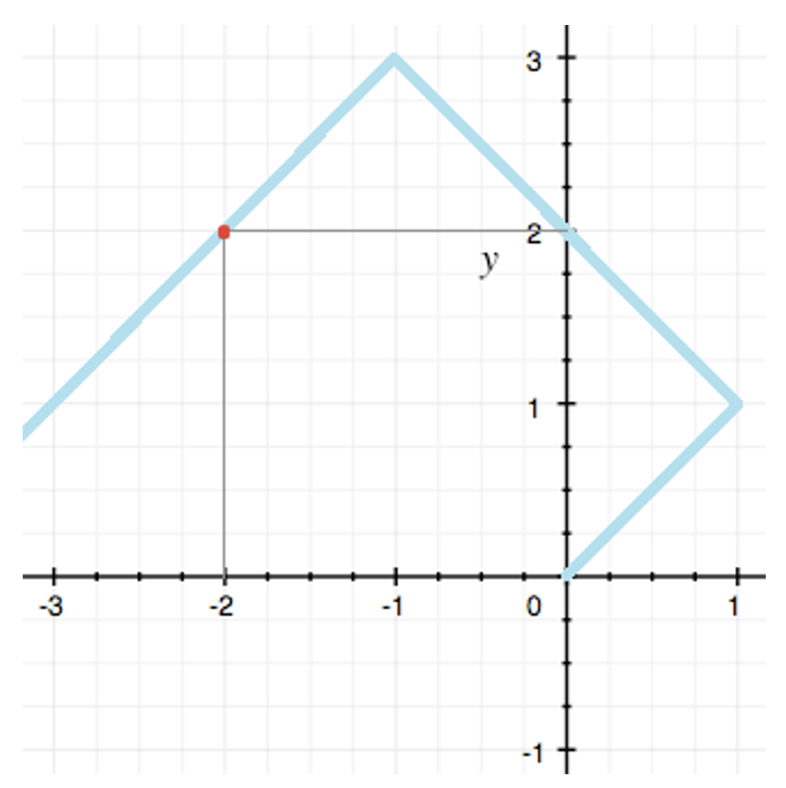
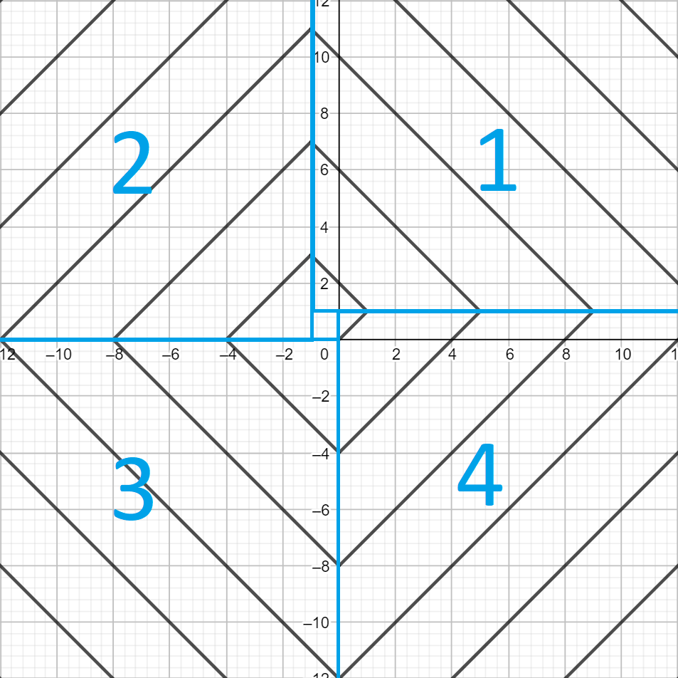

---
hide:
  - toc
---

# 4 - Levi

#  "Zadatak"

| Vremensko ograničenje | Memorijsko ograničenje |
|:-:|:-:|
| 100ms | 64MB |

Mali Perica je na skupu hakera koji se održava u Severnoj Koreji. Perica je načuo da će grupa hakera iskoristiti skup da probije zaštitu i ukrade zadatke za jedno takmičenje iz programiranja. Perica, koji je inače član komisije, želi da ih zaustavi ali prvo mora da ih pronađe.

Pjongjang (glavni grad Severne Koreje u kome su smešteni hakeri) je organizovan kao koordinatni sistem, i svi objekti imaju celobrojne koordinate. U gradu postoje tačno određena mesta na kojima je dostupan internet. Računarski centar ima koordinate (0, 0), a mrežni kabl se od centra pruža na veoma čudan način. Kabl kreće u pravcu (1, 1) i tu skreće na levo za 90 stepeni i pruža se dve jedinične dijagonale (do koordinata (-1, 3)), pa opet skreće na levo za 90 stepeni i pruža se tri jedinične dijagonale (do koordinata (-4, 0)), i tako dalje. Internet je dostupan u svim objektima kroz koje kabl prolazi, uključujući računarski centar.

Mali Perica zna da se hakeri nalaze u nekom objektu, ali Pjongjang je veliki grad tako da Perica nema vremena da proveri sve objekte u kojima je dostupan internet. Zato je odabrao $Q$ koordinata i rešio da proveri samo objekte na tim koordinatama. Međutim, Perica ne želi da gubi vreme proveravajući objekte u kojima internet nije dostupan, a kako je u velikoj žurbi, pitao je vas za pomoć. Pomozite Perici i za svaki objekat sa njegove liste odgovorite da li je u tom objektu dostupan internet. 

## Opis ulaza
U prvom redu standardnog ulaza nalazi se ceo broj $Q$. Sledećih $Q$ redova sadrži po dva cela broja odvojena razmakom, $X$ i $Y$ koordinate objekta, redom.

## Opis izlaza
Za svaki objekat u novom redu standardnog izlaza odgovoriti sa „DA“ (bez navodnika) ukoliko je u objektu dostupan internet, inače sa „NE“ (bez navodnika).

## Primer 1
### Ulaz
```
1
-2 2
```

### Izlaz
```
DA
```

## Objašnjenje primera



Vidimo da mrežni kabl prolazi kroz objekat sa koordinatama (-2, 2).

## Ograničenja

* U 20% test primera $Q=1$, $|X|,|Y|\leq 20$
* U sledećih 20% test primera $Q≤100$, $|X|,|Y|\leq 100$
* U sledećih 60% test primera $Q\leq 10^5$, $|X|,|Y|≤10^9$

#  "Rešenje"

| Autor | Tekst i test primeri | Analiza rеšenja | Testiranje |
|:-:|:-:|:-:|:-:|
| Duško Obradović | Duško Obradović | Nemanja Majski | Marko Baković |

## Rešenje za $Q=1, |X|\le 20,|Y| \le 20$:
U ovom podzadatku je dovoljno ručno iskodirati proveru za svaku tačku koja se nalazi na kablu.

## Rešenje za $Q\le100, |X|\le 100,|Y| \le 100$:
U ovom podzadatku je potrebno napraviti matricu koja će za svako polje pamtiti da li se na njemu nalazi kabel. To je moguće uraditi tako što se pusti petlja koja će pratiti put kabla i obeležiti svaku tačku gde se on nalazi.

## Glavno rešenje:
Koordinatni sistem ćemo podeliti u 4 kvadranta. Onda ćemo za svaku tačku prvo videti u kom se kvadrantu nalazi, a onda proveriti da li se nalazi na kablu. Podela na kvadrante je prikazana na slici. Primetite da se kabel uvek nalazi na "dijagonali" kvadranta. Prvo ćemo proveriti u kom se kvadrantu nalazi svaka tačka, a onda da li je na njegovoj dijagonali. Ukoliko je tačka na granici više kvadranata, ne zanima nas u koji od tih je smestimo.



 - Kvadrant 1, $x\ge -1$ i $y\ge 1$. Tačka se nalazi na kablu ako i samo ako $(x+y)$ $mod$ $4=2$, gde $mod$ $4$ predstavlja ostatak deljenja broja sa $4$.
 - Kvadrant 2, $x\le -1$ i $y\ge 0$. Tačka se nalazi na kablu ako i samo ako $(x-y)$ $mod$ $4=0$, gde $mod$ $4$ predstavlja ostatak deljenja broja sa $4$.
 - Kvadrant 3, $x\le 0$ i $y\le 0$. Tačka se nalazi na kablu ako i samo ako $(x+y)$ $mod$ $4=0$, gde $mod$ $4$ predstavlja ostatak deljenja broja sa $4$.
 - Kvadrant 4, ako tačka ne pripada ostalim kvadrantima. Tačka se nalazi na kablu ako i samo ako $(x-y)$ $mod$ $4=0$, gde $mod$ $4$ predstavlja ostatak deljenja broja sa $4$.


``` cpp title="04_levi.cpp" linenums="1"
#include <cstdio>
#include <algorithm>
#include <cstring>

using namespace std;

int x,y,q;
bool ok;

inline bool upright() {
  int b=y-x;
  if (b>0) return false;
  if (b%4!=0) return false;
  if (y<b or y>1) return false;
  return true;
}
inline bool upleft() {
  int b=y+x;
  if (b<0) return false;
  if (b%4!=2) return false;
  if (y<1 or y>b+1) return false;
  return true;
}
inline bool downleft() {
  int b=y-x;
  if (b<0) return false;
  if (b%4!=0) return false;
  if (y<0 or y>b-1) return false;
  return true;
}
inline bool downright() {
  int b=y+x;
  if (b>0) return false;
  if (b%4!=0) return false;
  if (y>0 or y<b) return false;
  return true;
}
int main() {
  //freopen("levi.10.in", "r", stdin);
  //freopen("levi.10.sol", "w", stdout);
  scanf("%d", &q);
  for (int i=1; i<=q; i++) {
    scanf("%d %d",&x, &y);
    if (upright  ()) {printf("DA\n"); continue;}
    if (upleft   ()) {printf("DA\n"); continue;}
    if (downleft ()) {printf("DA\n"); continue;}
    if (downright()) {printf("DA\n"); continue;}
    printf("NE\n");
  }
  return 0;
}
```
