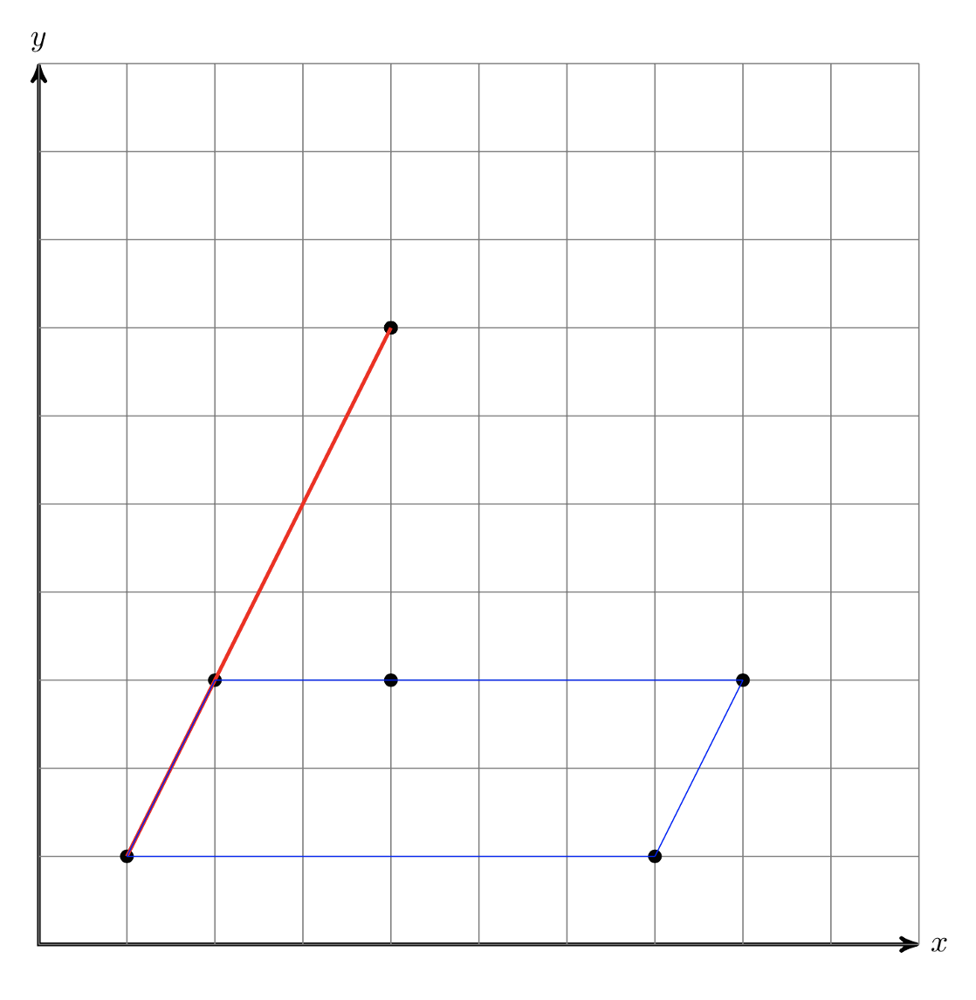

---
hide:
  - toc
---

# 5 - Klasifikacija figura

#  "Zadatak"

| Vremensko ograničenje | Memorijsko ograničenje |
|:-:|:-:|
| 1000ms | 64MB |

Mali Acko je jako uzbuđen povodom puštanja nove igre kompanije Mećava^TM, zvane Junaci Oluje, u zatvorenu beta fazu. Nažalost, Acko nije bio jedan od srećnika koji su dobili beta ključ, i zbog toga ne može da igra ovu igru. Međutim, njegov prijatelj mali Perica, poznat kao veliki haker, je odlučio da mu pomogne tako što će da provali bazu kompanije Mećava^TM i ukrade jedan beta ključ.

Perica je probio sve nivoe zaštite, osim poslednjeg. Poslednji nivo je jedna matematička zagonetka; zadat je jedan fajl u kome se nalazi $T$ zapisa. Jedan zapis se sastoji od broja $N$ i niza tačaka $(X_1,Y_1)$,$(X_2,Y_2)$,$\ldots$,$(X_N,Y_N)$. Za svaki zapis se postavlja pitanje: “Kada bi povukao izlomljenu liniju $(X_1,Y_1)-(X_2,Y_2)-\ldots-(X_N,Y_N)-(X_1,Y_1)$ koju bi figuru uočio na slici?”.

Perica je uspeo da pronađe misteriozni fajl Klase.txt koji sadrži sve moguće klase figura koje kompanija  Mećava^TM raspoznaje. Sadržina fajla je sledeća:

```
1.Duz
2.Trougao
  a.Jednakokraki
  b.Pravougli
  c.Jednakostranicni
3.Cetvorougao
  a.Paralelogram
  b.Romb
  c.Trapez
  d.Pravougaonik
  e.Kvadrat
4.Ostalo
```

Kako je Perica poznato loš sa geometrijom, zamolio vas je za pomoć sa ovim zadatkom.

## Opis ulaza
U prvom redu ulaza se nalazi broj zapisa $T$. Potom slede podaci o svakom zapisu pojedinačno. Svaki zapis se sastoji od broja tačaka $N$ i potom u svakom redu zasebno koordinatama svake tačke $(X_i,Y_i)$.

## Opis izlaza
Izlaz se sastoji od $T$ linija u formatu

```
PrimarnaKlasa - SekundarnaKlasa1,SekundarnaKlasa2, ...
```

Primarne klase su obeležene brojevima, a sekundarne slovima. Redosled klasa treba biti isti kao u fajlu Klase.txt.

## Primer 1
### Ulaz
```
2
3
1 1
2 3
4 7
5
1 1
7 1
8 3
4 3
2 3
```

### Izlaz
```
Duz
Cetvorougao - Paralelogram, Trapez
```

## Objašnjenje primera
Figure iz test primera se nalaze na slici dole. Crvenom bojom je označena figura 1, a plavom figura 2.

Prva figura je duž od tačke (1, 1) do tačke (4, 7), a druga je četvorougao između tačaka (1, 1), (7, 1), (8, 3) i (2, 3).



## Ograničenja
* $1\leq T\leq 50.000$, $-10.000\leq X_i,Y_i\leq 10.000$.
* Tačke obrazuju konveksan mnogougao i date su ili u smeru kazaljke na satu, ili u obrnutom smeru, osim u slučaju kada je rešenje duž, a tada su date redom kako se pojavljuju na duži.
* Za 20% test primera važi $2\leq N\leq 3$.
* Za ostalih 80% test primera važi $2\leq N\leq 10$.

#  "Rešenje"

| Autor | Tekst i test primeri | Analiza rеšenja | Testiranje |
|:-:|:-:|:-:|:-:|
| Aleksandar Ivanović | Ivan Stošić | - | Demjan Grubić |


``` cpp title="05_klasifikacija_figura.cpp" linenums="1"
#include <cstdio>
#include <cstring>
#include <algorithm>
using namespace std;

struct tacka{
    int x,y;
};

int sp(tacka a,tacka b){
    return a.x*b.x+a.y*b.y;
}

tacka minus(tacka a,tacka b){
    a.x -= b.x;
    a.y -= b.y;
    return a;
}

bool je0(tacka a,tacka b){
    return a.x*b.y == b.x*a.y;
}

bool kolin(tacka a,tacka b,tacka c){
    return je0(minus(a,b),minus(b,c));
}

bool prav_ugao(tacka a,tacka b,tacka c){
    return sp(minus(b,a),minus(b,c)) == 0;
}

bool paralelne(tacka a,tacka b,tacka c,tacka d){
    //a-b i c-d
    return je0(minus(a,b),minus(c,d));
}

int kv(int x){
    return x*x;
}

int d2(tacka a,tacka b){
    return kv(a.x-b.x)+kv(a.y-b.y);
}

bool pravougli_trougao(tacka a,tacka b,tacka c){
    return prav_ugao(a,b,c)||prav_ugao(b,c,a)||prav_ugao(c,a,b);
}

bool jednakokraki_trougao(tacka a,tacka b,tacka c){
    int x=d2(a,b);
    int y=d2(b,c);
    int z=d2(c,a);
    return (x==y)||(y==z)||(z==x);
}

bool paralelogram(tacka a,tacka b,tacka c,tacka d){
    return paralelne(a,b,c,d) && paralelne(b,c,d,a);
}

bool romb(tacka a,tacka b,tacka c,tacka d){
    return paralelogram(a,b,c,d) && d2(a,b)==d2(b,c);
}

bool trapez(tacka a,tacka b,tacka c,tacka d){ //i paralelogram je trapez
    return paralelne(a,b,c,d) || paralelne(b,c,d,a);
}

bool pravougaonik(tacka a,tacka b,tacka c,tacka d){
    return paralelogram(a,b,c,d) && prav_ugao(a,b,c);
}

bool jednakostranicni(tacka a,tacka b,tacka c){
    return false; //hehe
}

bool kvadrat(tacka a,tacka b,tacka c,tacka d){
    return romb(a,b,c,d) && prav_ugao(a,b,c);
}

tacka A[15],B[15];
int N,T,i,j,k;

void lep_print(int &x){
    if (j==0) printf(" - ");
    else printf(", ");
    j++;
}

int main(){
    scanf("%d",&T);
    while (T--){
        scanf("%d",&N);
        for (i=1; i<=N; i++) scanf("%d%d",&A[i].x,&A[i].y);
        A[0] = A[N];
        A[N+1] = A[1];
        k=0;
        for (i=1; i<=N; i++){
            if (!kolin(A[i-1],A[i],A[i+1])){
                k++;
                B[k] = A[i];
            }
        }
        if (k<=2){
            printf("Duz\n");
        } else
        if (k==3){
            printf("Trougao");
            j=0;
            if (jednakokraki_trougao(B[1],B[2],B[3])){
                lep_print(j);
                printf("Jednakokraki");
            }
            if (pravougli_trougao(B[1],B[2],B[3])){
                lep_print(j);
                printf("Pravougli");
            }
            printf("\n");
        } else
        if (k==4){
            printf("Cetvorougao");
            j=0;
            if (paralelogram(B[1],B[2],B[3],B[4])){
                lep_print(j);
                printf("Paralelogram");
            }
            if (romb(B[1],B[2],B[3],B[4])){
                lep_print(j);
                printf("Romb");
            }
            if (trapez(B[1],B[2],B[3],B[4])){
                lep_print(j);
                printf("Trapez");
            }
            if (pravougaonik(B[1],B[2],B[3],B[4])){
                lep_print(j);
                printf("Pravougaonik");
            }
            if (kvadrat(B[1],B[2],B[3],B[4])){
                lep_print(j);
                printf("Kvadrat");
            }
            printf("\n");
        } else {
            printf("Ostalo\n");
        }
    }
    return 0;
}
```
