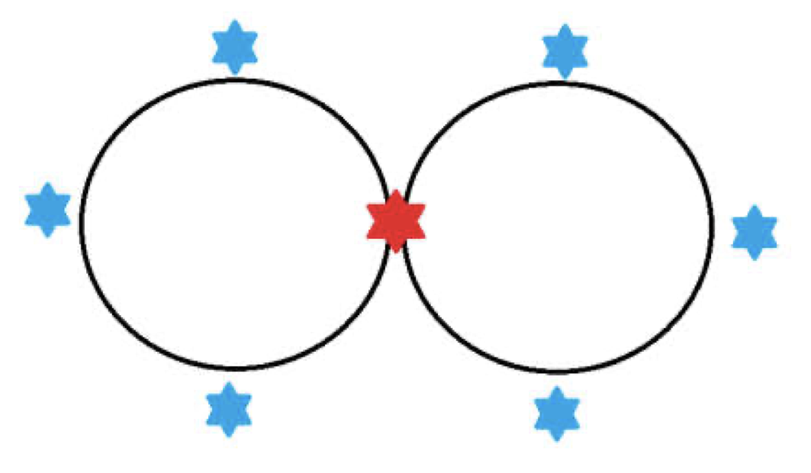

---
hide:
  - toc
---

# B2 - (Novi) Vavilon

#  "Zadatak"

| Vremensko ograničenje | Memorijsko ograničenje |
|:-:|:-:|
| 1000ms | 64MB |

Neposredno pre 626. godine p.n.e. na području Mesopotamije je izbio veliki građanski sukob. Pobunjeni građanin Napobalasar je želeo da zbaci sa vlasti tadašnje vladare Asirce i da osnuje Haldejsko carstvo, odnosno Novi Vavilon. Interesantna činjenica je da je svaki od građana tadašnje Mesopotamije imao jedinstveni matični broj građana koji je ceo broj iz intervala $[1, m]$. Napobalasar je takođe bio visoki sveštenik vudu religije Avalon koja mnogo veruje u okrugle stolove i verovao je da postići pobedu ako i samo ako uspe da građane rasporedi na stolu u obliku osmice koji je sastavljen od dva kružna stola kapaciteta n, tako da on sedi na mestu koje spaja te stolove i da važi da je najmanji zajednički sadržalac jedinstvenih matičnih brojeva građanana jednom stolu jednak  najvećem zajedničkom deliocu jedinstvenih matičnih brojeva građana na drugom stolu i da je ta vrednost upravo jednaka vrednosti njegovog jedinstvenog matičnog broja građana. Napobalasar trenutno nema vremena da izračuna na koliko načina može rasporediti građane na ovakvom stolu, pa vas moli za pomoć kako bi sagradio Novi Vavilon. Pošto ovaj broj može biti veoma velik, vaš zadatak je da ispišete ostatak pri deljenju ovog broja brojem $10^9 + 7$.

## Opis ulaza
U prvoj i jedinoj liniji standardnog ulaza se nalaze tri cela broja $n, m$ i $id$ koja redom predstavljaju kapacitet svakog od kružnih stolova, broj ljudi koji žive u Mesopotamiji i Napobalasarov jedinstveni matični broj građana.

## Opis izlaza
U prvoj i jedinoj liniji standardnog izlaza treba ispisati ostatak pri deljenju broja xnačina na koji Napobalasar može izabrati građane po opisanom verovanju, brojem $10^9 + 7$.

## Primer 1
### Ulaz
```
4 48 12
```

### Izlaz
```
720
```

## Primer 2
### Ulaz
```
4 38 12
```

### Izlaz
```
0
```

## Objašnjenja primera



Na slici iznad su ilustrovani dati primer, gde crveno mesto predstavlja Napobalasara. U prvom test primeru, Napobalasar može za jednim stolom da rasporedi ljude sa jedinstevnim matičnim brojevima građana 1, 2, 3, 4, 6 tako da njihov najmanji zajednički sadržalac iznosi 12 i on to može uraditi na 5 · 4 · 3 = 60 načina, a za drugim stolom može da rasporedi ljude sa matičnim brojevima 24, 36, 48 tako da je njihov najveći zajednični delilac jednak 12 i on to može uraditi na 3 · 2 · 1=6 načina. Konačan rezultat je (60 · 6) · 2 pošto prvu grupu ljudi može staviti ili na levi ili na desni sto.

U drugom test primeru, Napobalasar nikako ne može za drugim stolom da rasporedi 3 građana tako da njihov najveći zajednički delilac iznosi 12, pa je broj načina 0.

## Ograničenja

* $1 \leq n \leq 10^6$
* $1 \leq m \leq 10^9$
* $1 \leq id \leq m$

## Napomena
Svaki od građana ima jedinstven matični broj. Nijedan sto ne sme imati prazno mesto. Test primeri su podeljeni u tri disjunktne grupe:

* U test primerima vrednim 20 poena važiće $n = 2$.
* U test primerima vrednim 20 poena važiće $m \leq 10^3$.
* U test primerima vrednim 60 poena nema dodatnih ograničenja.

#  "Rešenje"

| Autor | Tekst i test primeri | Analiza rеšenja | Testiranje |
|:-:|:-:|:-:|:-:|
| Nikola Jovanović | Dimitrije Erdeljan | Marko Ilić | Nikola Jovanović |

## Rešenje za $N = 2$:
U ovom podzadataku treba izabrati jednog građanina čiji je matični broj delilac broja $id$ i jednog čiji je matični broj umnožak broja $id$. Ako $id$ ima $x$ delilaca i $y$ umnožaka ne većih od $m$, onda je ukupan broj odgovarajućih rasporeda građana jednak $2 \cdot (x-1) \cdot (y-1)$ (minus jedan u zagradama zato što ne možemo da biramo Napobalasara, puta dva, jer mi određujemo ko ide na koji sto). Vrednost $x$ ćemo dobiti tako što ćemo iterirati po celobrojnim vrednostima $a$ od $1$ do $\sqrt id$ i za svako $a$ koje deli $id$ povećati brojač za 2, jednom za sam broj $a$, a drugi put za njegov par $id / a$, do kog nećemo doći u ovoj petlji jer je veći od $\sqrt id$. Na kraju, ukoliko je $id$ potpun kvadrat brojač treba smanjiti za jedan jer smo ga za $a = \sqrt id$ dvaput povećali za istu vrednost. Vrednost $y$ je jednaka $\lfloor {m/id} \rfloor$, gde $\lfloor x \rfloor$ predstavlja najmanji ceo broj ne veći od $x$. Vremenska složenost: $O(\sqrt {id})$. Memorijska složenost: $O(1)$.

## Rešenje za $1 \le m \le 10^3$:
Za razliku od prethodnog podzadatka, u ovom vrednosti $x$ i $y$ možemo dobiti iteriranjem po brojevima od 1 do $m$ i povećavanjem $x$ ukoliko je posmatrani broj delilac broja $id$, a $y$ ukoliko je umnožak broja $id$. Rešenje je: 
$$
2 \cdot (x-1) \cdot (x-2) \cdot \ldots \cdot (x-N+1) \cdot (y-1) \cdot (y-2) \cdot \ldots \cdot (y-N+1).$$ 
Vremenska složenost: $O(M + N)$. Memorijska složenost: $O(1)$.

## Glavno rešenje:
Za svih $100$ poena treba iskoristiti ideje iz prethodna dva podzadatka. Vrednosti $x$ i $y$ ćemo naći kao u prvom podzadatku, a potom primeniti formulu iz drugog podzadatka. Vremenska složenost: $O(\sqrt {id} + N)$. Memorijska složenost: $O(1)$.

``` cpp title="02_novi_vavilon.cpp" linenums="1"
#include <iostream>

using namespace std;

const long long MOD = 1000000007;

int main()
{
	long long n, m, id;
	cin >> n >> m >> id;

	int high = m / id - 1;
	int low = 0;
	for(int i = 1; i * i <= id; i++)
		if(id % i == 0)
		{
			low++;
			if(i*i != id && id/i < id) low++;
		}

	if(high + 1 < n || low + 1 < n)
	{
		cout << 0 << endl;
		return 0;
	}
	
	long long res = 2;
	for(int i = 0; i < n - 1; i++)
	{
		res *= high - i;
		res %= MOD;
		res *= low - i;
		res %= MOD;
	}

	cout << res << endl;
	return 0;
}

```
