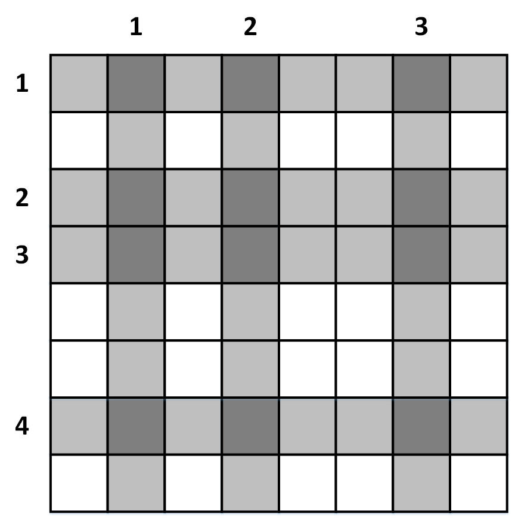
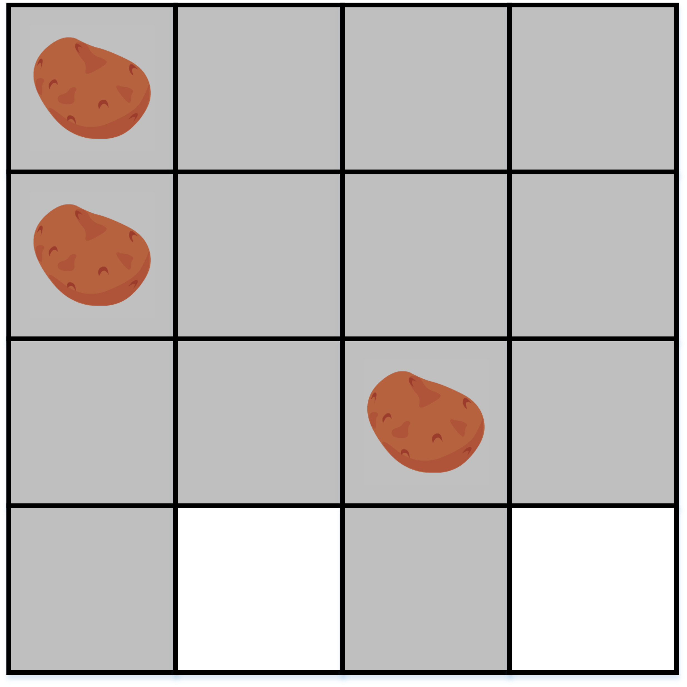

---
hide:
  - toc
---

# B1 - Krompir

#  "Zadatak"

| Vremensko ograničenje | Memorijsko ograničenje |
|:-:|:-:|
| 500ms | 256MB |

Mars. Druga najmanja planeta Solarnog sistema, prečnika dva puta manjeg od Zemlje čija je godina otprilike dva puta duža od Zemljine, planeta koja poseduje dva prirodna satelita i drugu najvišu planinu u Sunčevom sistemu. Slučajnost? Tako ne misli Mateja Dejmon, astro-botaničar koji je greškom ostao ostavljen na ovoj planeti kada je peščana oluja omela istraživačku misiju Ares $3$.

On na raspolaganju ima svoju bazu, nekoliko kila krompira i plodno marsovsko zemljište dimenzije $N \times N$ metara koje je on izdelio na $N^2$ polja dimenzija $1 \times 1$ metar (raspoređenih u $N$ redova i $N$ kolona) a zatim posadio $M$ krompira u nekih $M$ polja (tih $M$ polja ćemo zvati **početna polja**).  Međutim, zbog posebnog sastava marsovskog zemljišta, **krompir je, osim na $M$ početnih polja, izrastao i na svakom polju u čijem se redu ili koloni nalazilo bar jedno od $M$ početnih polja.**

**Ukoliko vam je poznato gde je Mateja posadio krompire**, pomozite mu da izračuna **na koliko je ukupno polja izrastao krompir** kako bi procenio svoje zalihe za čekanje na misiju Ares $4$.

## Opis ulaza
U prvom redu standardnog ulaza nalaze se dva prirodna broja $N$ i $M$, razdvojena razmakom, koja redom predstavljaju dimenziju zemljišta i broj početnih polja na kojima je zasađen krompir. Zatim sledi opis početnih polja: u narednih $M$ redova nalaze se po dva prirodna broja $x_i$ i $y_i$, razdvojena razmakom, koja označavaju da je $i$-ti krompir zasađen u polju koje se nalazi u $x_i$-tom redu (gledano odozgo nadole) i $y_j$-toj koloni (gledano s leva nadesno).

## Opis izlaza
U prvom i jedinom redu standardnog izlaza treba ispisati jedan prirodan broj - ukupan broj polja na kojima je izrastao krompir.

## Primer 1
### Ulaz
```
4 3
1 1
2 1
3 3
```

### Izlaz
```
14
```

## Primer 2
### Ulaz
```
3 1
2 2
```

### Izlaz
```
5
```

## Objašnjenje primera
U prvom test primeru je $N = 4$ i $M = 3$, tj. Mateja Dejmon je zasadio 3 krompira čije su početne pozicije prikazane na slici. Na istoj slici su sivom bojom označena sva polja na kojima je izrastao krompir i njih ima ukupno 14 što je rešenje za ovaj primer. U drugom primeru krompir neće izrasti u u ugaonim poljima zemljišta $3 \times 3$ a u svim ostalim hoće.



## Ograničenja
* $1 \leq N \leq 10^6$
* $1 \leq x_i, y_i \leq N$
* Sva početna polja su različita

Test primeri su podeljeni u $4$ disjunktne grupe:

* U test primerima koji vrede $20$ poena važi $M = 2$.
* U test primerima koji vrede $30$ poena važi $1 \leq M \leq 500$, $1 \leq N \leq 500$.
* U test primerima koji vrede $20$ poena važi $1 \leq M \leq 5000$.
* U test primerima koji vrede $30$ poena važi $1 \leq M \leq 10^5$.

## Napomena
Obratite pažnju da je za rešenje potrebno koristiti $64$-bitni tip podataka.

#  "Rešenje"

| Autor | Tekst i test primeri | Analiza rеšenja | Testiranje |
|:-:|:-:|:-:|:-:|
| Nikola Milosavljević | Nikola Milosavljević | Nikola Milosavljević | Ivan Dejković |

##Glavno rešenje
Posmatrajmo slučajeve gde je broj početnih polja ($M$) mali, kao što i sugeriše prvi podzadatak. Jasno je da je za $M = 1$ rešenje $2N - 1$ (samo polja u odgovarajućoj vrsti i koloni) *bez obzira na to gde se početno polje nalazi.* Za $M = 2$ lako se uočava da je dovoljno posmatrati samo dva slučaja: $1)$ ukoliko početna polja nisu u istoj vrsti ni koloni, tada je rešenje $4N - 4$ jer zauzimamo po dve vrste i kolone, ali, u njihovom preseku se nalaze 4 polja koja brojimo 2 puta pa otud oduzimanje; $2)$ ukoliko su početna polja su u istoj vrsti ili koloni tada imamo vrstu/kolonu manje pa je rešenje $3N - 2$. 

Za drugi podzadatak je dovoljno odraditi direktnu simulaciju -- za svako početno polje $(x,y)$ markirati sva polja neke matrice $N \times N$ oblika $(x, i)$ i $(y, j)$ i na kraju prebrojati markirana polja u matrici. Vremenska složenost ovog pristupa je $O(M\cdot N + N^2)$ a memorijska $O(N^2)$ pa je jasno da će nam za ostale podzadatke trebati bolji algoritam. 

Na osnovu prethodne diskusije, prirodno se nameće činjenica da rešenje ne zavisi od *tačnih* položaja početnih polja već samo od njihovog *međusobnog* položaja, a prevashodno od toga da li su u istoj vrsti/koloni. Neka je $a$ broj vrsta u kojima se nalazi bar jedan krompir a $b$ - broj kolona u kojima se nalazi bar jedan krompir. Jasno, na svakom polju ovih $a$ vrsta i $b$ kolona će izrasti krompir dok će ostala polja ostati prazna. Prema tome, ukupno imamo $a + b$ pokrivenih vrsta/kolona koje međusobno imaju ukupno $ab$ presečnih polja koja ne smemo da računamo dva puta, pa je ukupan broj polja sa krompirima jednak $(a + b)N - ab$. 

Slika $1$:  Za $N = 8$, $a = 4$ i $b = 3$ imamo $(4+3)\cdot 8 - 4\cdot 3 = 44$ sigurnih polja



Dakle, dovoljno je odrediti vrednosti $a$ i $b$. Broj $a$ je jednak broju različitih elemenata u nizu $x_1, x_2, \ldots, x_M$ (analogno za $b$ i niz $y$) a ovo je poznat problem koji se može uraditi sortiranjem niza $x$ i upoređivanjem uzastopnih elemenata. Složenost ovog pristupa je složenost soritranja niza dužine $M$ a za treći podzadatak je dovoljno koristiti i algoritme sortiranja složenosti $O(M^2)$.

Za kompletno rešenje zadatka nije neophodno sortiranje; dovoljno je primetiti da su vrednosti niza $x$ celi brojevi iz segmenta $[1, N]$ pa možemo koristiti pomoćni logički niz $row$ dužine $N$ i za svako $x_i$ markirati element $row[x_i]$. Na kraju, broj markiranih elementa je upravo broj $a$ (slično i za drugi pomoćni niz i broj $b$). Vremenska složenost ovog pristupa je $O(N + M)$ uz $O(N)$ memorije, i nosi maksimalan broj poena.

``` cpp title="01_krompir.cpp" linenums="1"
#include <cstdlib>
#include <cstdio>

const int MAX_N = 1000100;

int n, m;
bool row[MAX_N], col[MAX_N];
long long a, b, sol;

int main()
{
scanf("%d%d", &n, &m);
for (int i = 1; i <= n; i++)
{
	row[i] = false;
	col[i] = false;
}

for (int i = 1; i <= m; i++)
{
	int x, y;
	scanf("%d%d", &x, &y);
	row[x] = true;
	col[y] = true;
}

a = 0LL;
b = 0LL;
for (int i = 1; i <= n; i++)
{
	if (row[i] == true) a++;
	if (col[i] == true) b++;
}

sol = a * n + b * n - a * b;
printf("%lld\n", sol);
return 0;
}

```
