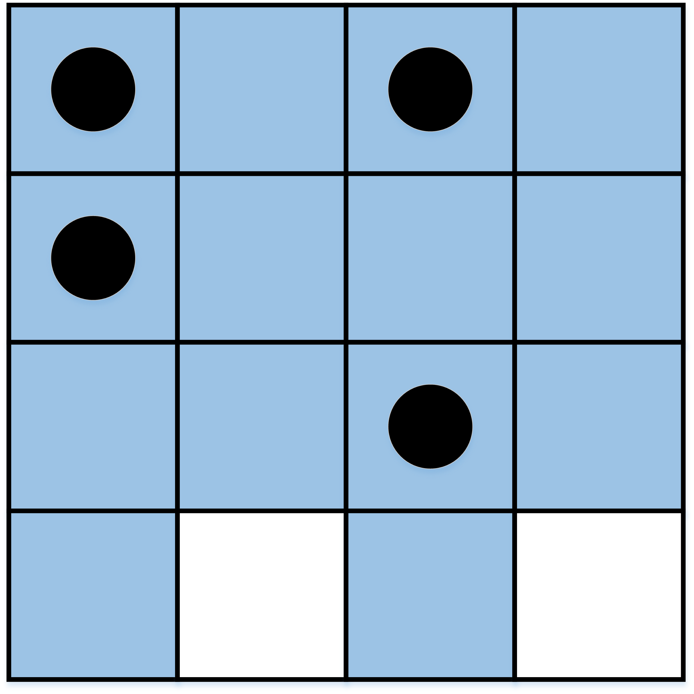
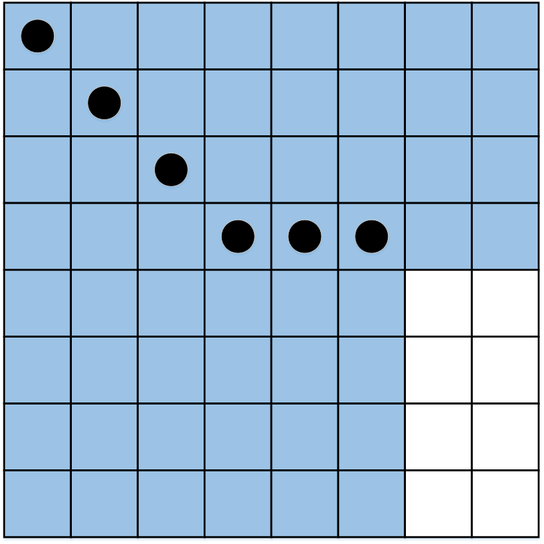

---
hide:
  - toc
---

# A1 - Baza

#  "Zadatak"

| Vremensko ograničenje | Memorijsko ograničenje |
|:-:|:-:|
| 1000ms | 256MB |

Mars. Četvrta planeta od Sunca, nazvana po Rimskom bogu rata, poznata i kao "crvena planeta" zbog gvožđe(III)oksida koji preovlađuje na njenoj površini, planeta čiji je astronomski simbol ujedno i simbol za muški rod, čiji dan traje $24$ sata i $40$ minuta i za koju se priča da poseduje podzemne vode. Zašto su ove informacije bitne za zadatak? Nisu.

Kako priča obično ide, ljudska ekspedicija je sletela na Mars i odmah oformila bazu. Baza se nalazi na površini dimenzije $N \times N$ metara koja je, radi lakše navigacije, izdeljena na $N^2$ kvadratnih sektora dimenzija $1 \times 1$ metar (raspoređenih u $N$ redova i $N$ kolona). Ekspedicija, poučena klasičnim skaj-faj filmovima, želi da osigura bazu da ih ne bi iznenadilo neko opasno stvorenje poput Ejliena, Marvina Marsovca, Džona Kartera ili Meta Dejmona. To će odraditi tako što će u nekim sektorima postaviti senzore. Kažemo da je sektor **siguran** ukoliko se **u njegovom redu ili u njegovoj koloni nalazi bar jedan sektor sa senzorom** (naravno, iz ovoga sledi da su i sektori sa senzorima sigurni).

Pomozite ekspediciji da postavi senzore **tako da tačno $M$ sektora bude sigurno**. Zašto $M$, a ne svi? Zato što tada ne bi bilo mesta iznenađenjima, a tako skaj-faj filmovi ne funkcionišu.

## Opis ulaza
U prvom i jedinom redu standardnog ulaza nalaze se dva prirodna broja $N$ i $M$, razdvojena razmakom, koja, redom, predstavljaju dimenziju baze i broj sektora koji mora koji moraju biti sigurni.

## Opis izlaza
Ukoliko je nemoguće postaviti senzore tako da tačno $M$ sektora bude sigurno, u prvom i jedinom redu ispisati $-1$. U suprotnom, u prvom redu ispisati broj senzora $K$, a zatim u narednih $K$ redova opisati gde treba postaviti te senzore: u svakom redu po dva prirodna broja $x_i$ i $y_i$ koja označavaju da $i$-ti senzor treba postaviti u sektoru koji se nalazi u preseku $x_i$-te vrste i $y_i$-te kolone. Vrste su numerisane od $1$ do $N$ odozgo nadole, a kolone su numerisane od $1$ do $N$ sleva nadesno. U svakom sektoru sme biti najviše jedan senzor. Ukoliko ima više rešenja, ispisati bilo koje.

## Primer 1
### Ulaz
```
4 14
```

### Izlaz
```
4
1 1
1 3
2 1
3 3
```

## Primer 2
### Ulaz
```
10 24
```

### Izlaz
```
-1
```

## Objašnjenje primera
U prvom test primeru je $N = 4$ i $M = 14$, tj. traži se da tačno 14 sektora bude sigurno. Ovo je moguće postići i na slici je prikazan jedan od načina koji odgovara izlazu za ovaj primer. Crnim tačkama su označene pozicije senzora dok su sigurni sektori obojeni i ima ih tačno 14. Postoje i drugačija (tačna) rešenja. U drugom primeru nikako nije moguće obezbediti da baza $10 \times 10$ ima tačno 24 sigurna sektora pa je odgovor '-1' (bez navodnika).



## Ograničenja
* $1 \leq M \leq 10^{12}$.

Test primeri su podeljeni u $4$ disjunktne grupe:

* U test primerima koji vrede $10$ poena važi $1 \le N \leq 3$.
* U test primerima koji vrede $20$ poena važi $1 \leq N \leq 1000$, $M \leq 4N$.
* U test primerima koji vrede $25$ poena važi $1 \leq N \leq 10^6$.
* U test primerima koji vrede $45$ poena važi $1 \leq N \leq 10^{18}$.

#  "Rešenje"

| Autor | Tekst i test primeri | Analiza rеšenja | Testiranje |
|:-:|:-:|:-:|:-:|
| Nikola Milosavljević | Nikola Milosavljević | Nikola Milosavljević | Marko Savić |

##Prvi podzadatak
Prvi podzadatak se rešava trivijalnim razmatranjem slučajeva; za drugi podzadatak se lako uočava (npr. uz par nacrtanih primera) da za $N > 6$ ne smemo imati (ukupno) više od 4 vrste/kolone koje sadrže senzore (jer mora biti $M \leq 4N$) pa je broj senzora i njihov raspored prilično ograničen (pokazati da pri svim pomenutim uslovima broj senzora ne sme biti veći od 4!).

Razmatrajući kako položaj senzora utiče na broj sigurnih sektora i **koristeći rešenje prvog problema za B kategoriju** (obavezno pročitati i taj problem/rešenje!), uočava se da je dovoljno znati broj vrsta i broj kolona sa bar po jednim senzorom: ukoliko imamo tačno $a$ vrsta i tačno $b$ kolona sa bar po jednim senzorom tada je ukupan broj sigurnih sektora jednak $(a+b)N - ab$. Dakle, moguće je dobiti tačno $M$ sigurnih sektora ako i samo ako postoje prirodni brojevi $1 \leq a \leq N$ i $1 \leq b \leq N$ za koje važi
$$
(a+b)N - ab = M.
$$
Transformacijom prethodne jednačine za $a \neq N$ dobijamo $b = \frac{M - aN}{N - a}$, pa je jedan od načina za rešavanje ove jednačine ispitivanje svih kandidate za $a$ među brojevima $1,2,\ldots N$ i provera (za svaki od njih) da li je dobijeni broj $b$ ceo i iz segmenta $[1,N]$. Ovo vodi rešenju složenosti $O(N)$ što je dovoljno za treći podzadatak.

##Glavno rešenje
Za kompletno rešenje, potrebno je smanjiti broj kandidata za promeljive $a$ i $b$ iz gornje jednačine. Glavna stvar je uočiti da osim trivijalne nejednakosti $a \leq N$ (broj vrsta je $N$) važi i $aN \leq M$ jer $a$ vrsta sa senzorima znači bar $aN$ sigurnih polja (ovo smo mogli zaključiti i iz formule $b = \frac{M - aN}{N - a}$). Množeći nejednakosti $a \leq N$ i $a \leq \frac{M}{N}$ dobijamo $a \cdot a \leq N \cdot \frac{M}{N}$, odnosno $a \leq \sqrt{M}$ i analogno $b \leq \sqrt{M}$. Dakle, jedini kandidati za $a$ su $1,2,\ldots \sqrt{M}$ pa direktna provera daje rešenje složenosti $O(\sqrt{M})$ što nosi maksimalan broj poena. 

Ipak, *rešenje još uvek nije kompletno* -- da li za sve prirodne brojeve $a$ i $b$ možemo postaviti senzore tako da imamo tačno $a$ vrsta i tačno $b$ kolona sa bar po jednim senzorom? Odgovor je potvrdan - npr. ovo možemo odraditi tako što postavimo senzore u svim sektorima $(i,j)$ za koje je $1 \leq i \leq a$ i $1 \leq j \leq b$ (gornja-leva podmatrica dimenzije $a \times b$) ali je tada složenosti algoritma moramo dodati i složenost ispisa koja je $O(ab)$ što može biti i $\Theta(M)$ a ovo je previše sporo. Srećom, moguće je postaviti svega $\max\{a, b\} = O(\sqrt{M})$ senzora ukoliko ih (uz pretpostavku $a \leq b$) postavljamo u sektore $(1, 1)$, $(2, 2)$, $\ldots$, $(a, a)$, $(a, a + 1)$, $(a, a + 2)$, $\ldots$, $(a, b)$, kao na slici. Ovaj raspored senzora kompletira rešenje.

Slika $1$:  Raspored $\max\{a, b\}$ senzora za $N = 8$, $a = 4$ i $b = 6$:



``` cpp title="04_baza.cpp" linenums="1"
#include <cstdlib>
#include <cstdio>

long long n, m;

void solve()
{
	
	if (n == 1 && m == 1)
	{
		printf("1\n");
		printf("1 1\n");
		return;
	}
	if (n == 1 && m != 1)
	{
		printf("-1\n");
		return;
	}

	long long upBound = (n < m / n ? n : m / n);

	for (long long a = 1LL; a <= upBound; a++) // a = 1 hvata slucaj m = n^2
	{
		if (m - a * n > 0 && n - a > 0 && (m - a * n) % (n - a) == 0)
		{
			long long b = (m - a * n) / (n - a); // uvek vazi a <= b

			printf("%lld\n", b);
			for (long long i = 1; i <= a; i++)
			{
				printf("%lld %lld\n", i, i);
			}
			for (long long i = a + 1; i <= b; i++)
			{
				printf("%lld %lld\n", a, i);
			}
			return;
		}
	}

	printf("-1\n");
	return;
}

int main()
{
	scanf("%lld%lld", &n, &m);
	solve();
	return 0;
}

```
