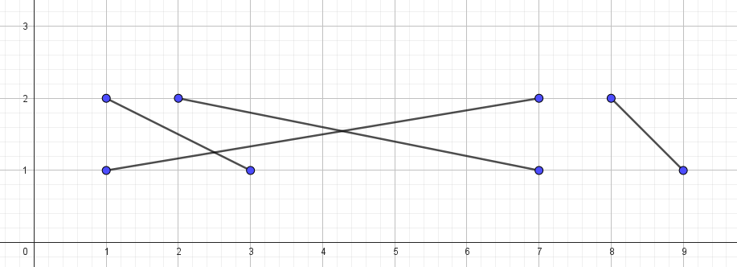
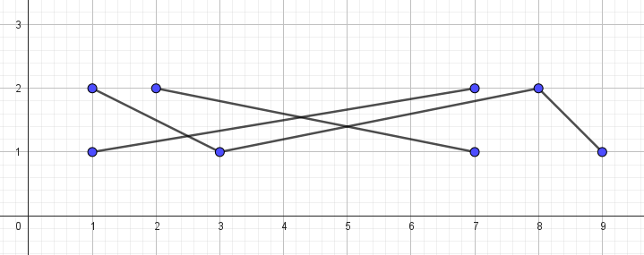

---
hide:
  - toc
---

# A1 - Žice

=== "Zadatak"

 | Vremensko ograničenje | Memorijsko ograničenje |
 |:-:|:-:|
 | 1000ms | 256MB |

Postoji N duži koje idu od $(a_i, 1)$ do $(b_i, 2)$. Koliko najmanje duži se mora spojiti kako bi postojao put od do bilo koje dve duži.
Duži se smatraju spojenim ako se seku ili ako dele zajedničku tačku.

## Opis ulaza

 U prvom redu je $N$, broj duži.
 U drugom redu nalazi se niz $N$ brojeva $a_1, a_2, ..., a_N$ -- koordinate krajeva duži sa prave $y = 1$.
 U trećem redu nalazi se niz $N$ brojeva $b_1, b_2, ..., b_N$ -- koordinate krajeva duži sa prave $y = 2$.

## Opis izlaza

 Na izlaz ispisati minimalan broj duži koje se moraju spojiti kako bi postojao put od do bilo koje dve duži.

## Ograničenja

- $1 \leq N \leq 3\cdot10^5$
- $1 \leq a_i, b_i \leq 10^9$
- $a_i \neq a_j$ za $i \neq j$
- $b_i \neq b_j$ za $i \neq j$

## Podzadaci

 1. (20 poena) $N \leq 5000$.
 2. (20 poena) Ne postoji put između duži $i$ i $j$ ako one nisu direktno spojene.
 3. (20 poena) Od svake duži postoji put do najviše 5 duži.
 4. (40 poena) Bez dodatnih ograničenja.

## Primeri

### Primer 1

#### Ulaz

 ```
 4
 1 3 7 9
 7 1 2 8
 ```

#### Izlaz

 ```
 2
 ```

#### Objašnjenje

 

 Potrebno je spojiti dve duži, na primer drugu i četvrtu, onda bi sve duži bile spojene.

 

### Primer 2

#### Ulaz

 ```
 6
 7 9 8 5 4 6 
 9 7 8 2 3 6
 ```

#### Izlaz

 ```
 3
 ```

#### Objašnjenje


=== "Rešenje"

 | Autor | Tekst i test primeri | Analiza rеšenja | Testiranje |
 |:-:|:-:|:-:|:-:|
 | Mladen Puzić | Mladen Puzić | Mladen Puzić | Pavle Martinović |

 Jednom komponentom žica zvaćemo skup svih žica do kojih stigne struja ako dodirnemo neku od njih.

## Rešenje za $N \leq 5000$

 Konstruišimo graf gde su čvorovi žice, a grana između dva čvora postoji ako se žice seku. Nakon ovoga dovoljno je primeniti bilo koji grafovski algoritam koji može brojati broj komponentni, na primer DFS (pretragu u dubinu). Vremenska i memorijska složenost: $O(N^2)$.

## Rešenje kada se žice seku sa svakom žicom do koje stiže struja

 Drugačije rečeno, u svakoj komponenti žica se svaka žica seče sa svakom. Za ovaj podzadatak nam je bila potrebna glavna ideja u zadatku: **kada sortiramo žice po $A_i$ svaka komponenta žica će se sastojati od uzastopnih žica**. Ovo možemo dokazati tako što pretpostavimo suprotno: postoji komponenta koja se sastoji od makar dva (odvojena) uzastopna niza žica. Da bi one bile u istoj komponenti, moraju se seći neka žica iz 'levog' intervala i neka iz 'desnog' intervala. Možemo videti ipak (najbolje ako ovo nacrtamo), da će bilo koja žica između ta dva intervala takođe morati da seče makar jednu od žica iz ta dva intervala, da bi stigla do druge strane.

 Kada znamo ovo, možemo da sortiramo žice po $A_i$, pa idemo sa levo na desno. Nova komponenta počinje na indeksu $i$ ako se žice $A_i$ i $A_{i-1}$ ne seku. Vremenska složenost: $O(NlogN)$,  memorijska složenost: $O(N)$.

## Rešenje kada se struja širi na još najviše 5 žica

 Drugačije rečeno, svaka komponenta je veličine najviše $6$. Ponovo sortiramo žice po $A_i$. Možemo rešiti podzadatak da više načina. Idemo opet sa leva na desno, i proveravamo za narednih $6$ žica da li pripadaju istoj komponenti, ako ne, proverimo umesto toga za $5$ žica, itd... Vremenska složenost: $O(NlogN)$, memorijska složenost: $O(N)$.

 Može se rešiti i grafovski slično rešenju za $N \leq 5000$.

## Glavno rešenje

 Ponovo sortirajmo žice po $A_i$. Numerišimo ih sa leva na desno brojevima od $1$ do $N$. Sada sortirajmo žice po $B_i$, i dodelimo im prethodne vrednosti (redni broj žice pri sortiranju po $A_i$). Tako dobijamo permutaciju brojeva od $1$ do $N$. Označimo sa $maxx_i$ maksimum prvih $i$ elemenata u permutaciji.

 Tražimo kraj prve komponente: to je najmanje $i$, tako da su prvih $i$ elemenata permutacije, permutacija brojeva od $1$ do $i$. To je u stvari najmanje $i$ za koje važi da je $maxx_i = i$. Sličnim rezonovanjem, dolazimo do zaključka da se svaka komponenta završava indeksom takav da važi $maxx_{index} = index$, pa je samo potrebno da izbrojimo takve indekse. Vremenska složenost: $O(NlogN)$, memorijska složenost: $O(N)$.

 ``` cpp title="04_zice.cpp" linenums="1"
 #include <bits/stdc++.h>
 
 using namespace std;
 #define MAXN 300010
 int A[MAXN], B[MAXN];
 vector<pair<int, int> > p;
 int main() {
     ios::sync_with_stdio(false); cin.tie(0);
     int N; cin >> N;
     for(int i = 1; i <= N; i++) {
         cin >> A[i];
     }
     for(int i = 1; i <= N; i++) {
         cin >> B[i];
     }
     for(int i = 1; i <= N; i++) p.push_back({A[i], B[i]});
     sort(p.begin(), p.end());
     sort(B+1, B+1+N);
     int maxx = 0, rez = 0, idxx = 0;
     for(auto x : p) {
         ++idxx;
         maxx = max(maxx, x.second);
         if(maxx == B[idxx]) rez++;
     }
     cout << rez;
     return 0;
 }

 ```
