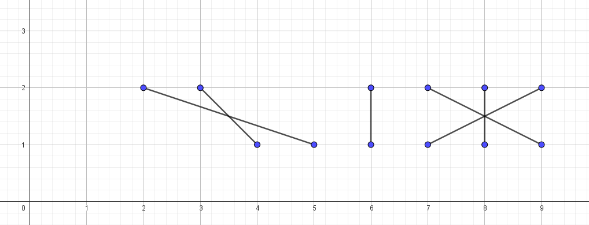

---
hide:
  - toc
---

# A1 - Žice

=== "Zadatak"

 | Vremensko ograničenje | Memorijsko ograničenje |
 |:-:|:-:|
 | 1000ms | 256MB |

Postoji N duži koje idu od $(a_i, 1)$ do $(b_i, 2)$. Koliko ostrva postoji?
Ostrvo je definisano kao skup duži koje se sve međusobno seku ili postoji neki put između njih preko drugih duži.
Ako duži dele zajedničku tačku, smatra se da se seku.

## Opis ulaza

 U prvom redu je $N$, broj duži.
 U drugom redu nalazi se niz $N$ brojeva $a_1, a_2, ..., a_N$ -- koordinate krajeva duži sa prave $y = 1$.
 U trećem redu nalazi se niz $N$ brojeva $b_1, b_2, ..., b_N$ -- koordinate krajeva duži sa prave $y = 2$.

## Opis izlaza

 Na izlaz ispisati broj ostrva.

## Ograničenja

- $1 \leq N \leq 3\cdot10^5$
- $1 \leq a_i, b_i \leq 10^9$
- $a_i \neq a_j$ za $i \neq j$
- $b_i \neq b_j$ za $i \neq j$

## Podzadaci

 1. (20 poena) $N \leq 5000$.
 2. (20 poena) U svakom ostrvu se svaka duž seče sa svakom.
 3. (20 poena) Od svake duži postoji put do najviše 5 duži.
 4. (40 poena) Bez dodatnih ograničenja.

## Primeri

### Primer 1

#### Ulaz

 ```
 4
 1 3 7 9
 7 1 2 8
 ```

#### Izlaz

 ```
 2
 ```

#### Objašnjenje

 

 Postoje dva ostrva.

### Primer 2

#### Ulaz

 ```
 6
 7 9 8 5 4 6 
 9 7 8 2 3 6
 ```

#### Izlaz

 ```
 3
 ```

#### Objašnjenje



Postoje tri ostrva.

=== "Rešenje"

 | Autor | Tekst i test primeri | Analiza rеšenja | Testiranje |
 |:-:|:-:|:-:|:-:|
 | Mladen Puzić | Mladen Puzić | Mladen Puzić | Pavle Martinović |

## Rešenje za $N \leq 5000$

 Konstruišimo graf gde su čvorovi duži, a grana između dva čvora postoji ako se duži seku ili dele tačku. Nakon ovoga dovoljno je primeniti bilo koji grafovski algoritam koji može brojati broj komponentni, na primer DFS (pretragu u dubinu). Vremenska i memorijska složenost: $O(N^2)$.

## Rešenje kada se sve duži u ostrvu seku

 Za ovaj podzadatak nam je bila potrebna glavna ideja u zadatku: **kada sortiramo duži po $A_i$ svako ostrvo će se sastojati od uzastopnih duži**. Ovo možemo dokazati tako što pretpostavimo suprotno: postoji ostrvo koja se sastoji od makar dva (odvojena) uzastopna niza duži. Da bi one bile u istom ostrvu, moraju se seći neka duž iz 'levog' intervala i neka iz 'desnog' intervala. Možemo videti ipak (najbolje ako ovo nacrtamo), da će bilo koja duž između ta dva intervala takođe morati da seče makar jednu od duži iz ta dva intervala, da bi stigla do druge strane.

 Kada znamo ovo, možemo da sortiramo duži po $A_i$, pa idemo sa levo na desno. Novo ostrvo počinje na indeksu $i$ ako se duži $A_i$ i $A_{i-1}$ ne seku. Vremenska složenost: $O(NlogN)$,  memorijska složenost: $O(N)$.

## Rešenje kada od svake duži postoji put do najviše 5 duži

 Drugačije rečeno, svako ostrvo je veličine najviše $6$. Ponovo sortiramo duži po $A_i$. Možemo rešiti podzadatak na više načina. Idemo opet sa leva na desno, i proveravamo za narednih $6$ duži da li pripadaju istom ostrvu, ako ne, proverimo umesto toga za $5$ duži, itd... Vremenska složenost: $O(NlogN)$, memorijska složenost: $O(N)$.

 Može se rešiti i grafovski slično rešenju za $N \leq 5000$.

## Glavno rešenje

 Ponovo sortirajmo duži po $A_i$. Numerišimo ih sa leva na desno brojevima od $1$ do $N$. Sada sortirajmo duži po $B_i$, i dodelimo im prethodne vrednosti (redni broj žice pri sortiranju po $A_i$). Tako dobijamo permutaciju brojeva od $1$ do $N$. Označimo sa $maxx_i$ maksimum prvih $i$ elemenata u permutaciji.

 Tražimo kraj prvog ostrva: to je najmanje $i$, tako da su prvih $i$ elemenata permutacije, permutacija brojeva od $1$ do $i$. To je u stvari najmanje $i$ za koje važi da je $maxx_i = i$. Sličnim rezonovanjem, dolazimo do zaključka da se svako ostrvo završava indeksom takav da važi $maxx_{index} = index$, pa je samo potrebno da izbrojimo takve indekse. Vremenska složenost: $O(NlogN)$, memorijska složenost: $O(N)$.

 ``` cpp title="04_zice.cpp" linenums="1"
 #include <bits/stdc++.h>
 
 using namespace std;
 #define MAXN 300010
 int A[MAXN], B[MAXN];
 vector<pair<int, int> > p;
 int main() {
     ios::sync_with_stdio(false); cin.tie(0);
     int N; cin >> N;
     for(int i = 1; i <= N; i++) {
         cin >> A[i];
     }
     for(int i = 1; i <= N; i++) {
         cin >> B[i];
     }
     for(int i = 1; i <= N; i++) p.push_back({A[i], B[i]});
     sort(p.begin(), p.end());
     sort(B+1, B+1+N);
     int maxx = 0, rez = 0, idxx = 0;
     for(auto x : p) {
         ++idxx;
         maxx = max(maxx, x.second);
         if(maxx == B[idxx]) rez++;
     }
     cout << rez;
     return 0;
 }

 ```
