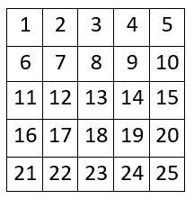
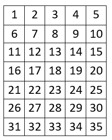

---
hide:
  - toc
---

# 2 - Finale

#  "Zadatak"

| Vremensko ograničenje | Memorijsko ograničenje |
|:-:|:-:|
| 100ms | 32MB |

Bliži se finale svetskog prvenstva i organizatori su zabrinuti za bezbednost na tribinama. Naime postoji šansa da dođe do sukoba između navijača suparničkih timova. Zato je odlučeno da se napravi revolucionarni raspored tribina. 

Sedišta tribina su raspoređena u $N$ redova sa po $M$ sedišta. Moguće je prolaziti između bilo koja dva sedišta, kao i sa spoljašnjih strana ivičnih sedišta (ovo možemo posmatrati kao $N \times M$ matricu, gde polja predstavljaju sedišta, a ivice puteve). Organizatori žele da postave redare na neka od sedišta tako da svi putevi budu obezbeđeni. Svaki redar čuva 4 puta oko svog sedišta. Organizatori od vas traže da nađete minimalan broj redara koji je potreban da se ovo uradi.

## Opis ulaza
U jedinom redu standardnog ulaza se nalaze brojevi $N$ i $M$ - broj redova i broj sedišta po redu.

## Opis izlaza
U jedinom redu standardnog izlaza ispisati minimalan broj redara potreban da se obezbede tribine.

## Primer 1
### Ulaz
```
5 5
```

### Izlaz
```
20
```

## Primer 2
### Ulaz
```
7 5
```

### Izlaz
```
27
```

## Objašnjenje primera
U prvom primeru, numerišimo tribine na sledeći način:



Jedan moguć raspored redara je da se redari smeste na sedišta $1, 2, 3, 4, 5, 6, 8, 10, 11, 12, 14, 15, 16, 18, 20, 21, 22, 23, 24, 25$.

U drugom primeru numerišimo tribine na sledeći način:



Jedan moguć raspored redara je da se redari smeste na sedišta $1, 2, 3, 4, 5, 6, 8, 10, 11, 12, 14, 15, 16, 18, 20, 21, 22, 24, 25, 26, 28, 30, 31, 32, 33, 34, 35$.

## Ograničenja

- $1 \leq N, M \leq 10^9$.

Test primeri su podeljeni u pet disjunktnih grupa:

- U testovima vrednim 20 poena: $N = 3$.
- U testovima vrednim 20 poena: $N, M \leq 5$.
- U testovima vrednim 20 poena: $N = M$.
- U testovima vrednim 20 poena: $N \times M \leq 2 \times 10^5$.
- U testovima vrednim 20 poena: Bez dodatnih ograničenja.

#  "Rešenje"

| Autor | Tekst i test primeri | Analiza rеšenja | Testiranje |
|:-:|:-:|:-:|:-:|
| Marko Milenković | Marko Šišović | Jovan Bengin | Vladimir Milovanović |

## Glavno rešenje
Ako posmatramo puteve na rubu matrice, vidimo da i sva polja na rubu (tj. prvi i poslednji red i kolona) moraju imati redara. Ako je $N \leq 2$ ili $M \leq 2$, to znači da će sva polja u matrici imati redara, pa je u tom slučaju rešenje $N \times M$.

Nadalje pretpostavljamo da važi $N, M \geq 3$. Posmatrajmo matricu dobijenu brisanjem prvog i poslednjeg reda i kolone - u ovoj novoj $(N-2) \times (M-2)$ matrici ćemo tražiti maksimalan broj polja gde ne moramo postaviti redare, ako znamo da su svi putevi na rubu već pokriveni. 
Za svaka dva susedna polja važi da barem jedno od njih ima redara, jer inače put koji ih razdvaja ne bi bio pokriven. Ovaj uslov je i dovoljan, jer će tada i svi putevi biti pokriveni.

Dakle, potrebno je naći najveći skup polja u kome ne postoje dva susedna. Ovo je poznat zadatak: obojimo matricu šahovski crno-belo i uzmemo sva polja one boje koja se više puta pojavljuje. Pošto se broj polja crne i bele boje razlikuje za najviše jedan, biće $\lceil \frac{(N-2) \cdot (M-2)}{2} \rceil$ polja jedne, i $\lfloor \frac{(N-2) \cdot (M-2)}{2} \rfloor$ polja druge boje. To znači da možemo imati maksimalno $\lceil \frac{(N-2) \cdot (M-2)}{2} \rceil$ polja bez redara, pa je minimalan broj redara $N \cdot M - \lceil \frac{(N-2) \cdot (M-2)}{2} \rceil$.

``` cpp title="02_finale.cpp" linenums="1"
#include <bits/stdc++.h>
using namespace std;

int main(){
    int n, m;
    cin>>n>>m;
    if(n == 1){
        cout<<m;
    }
    else if(m == 1){
        cout<<n;
    }
    else
    {
        cout<<2ll*n + 2ll*m - 4 + 1ll*(n-2)*(m-2)/2;
    }
}

```
