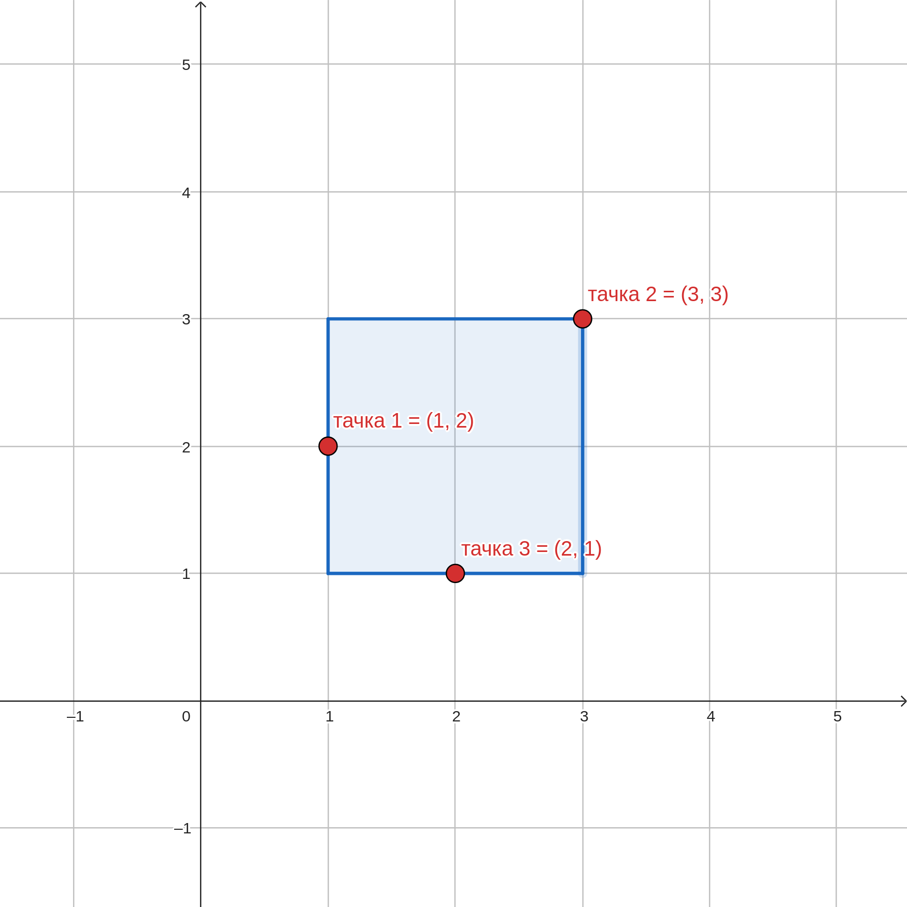
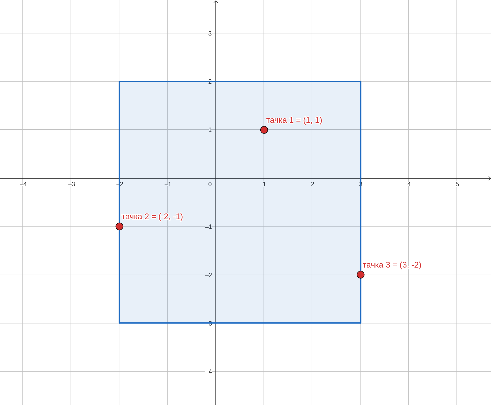
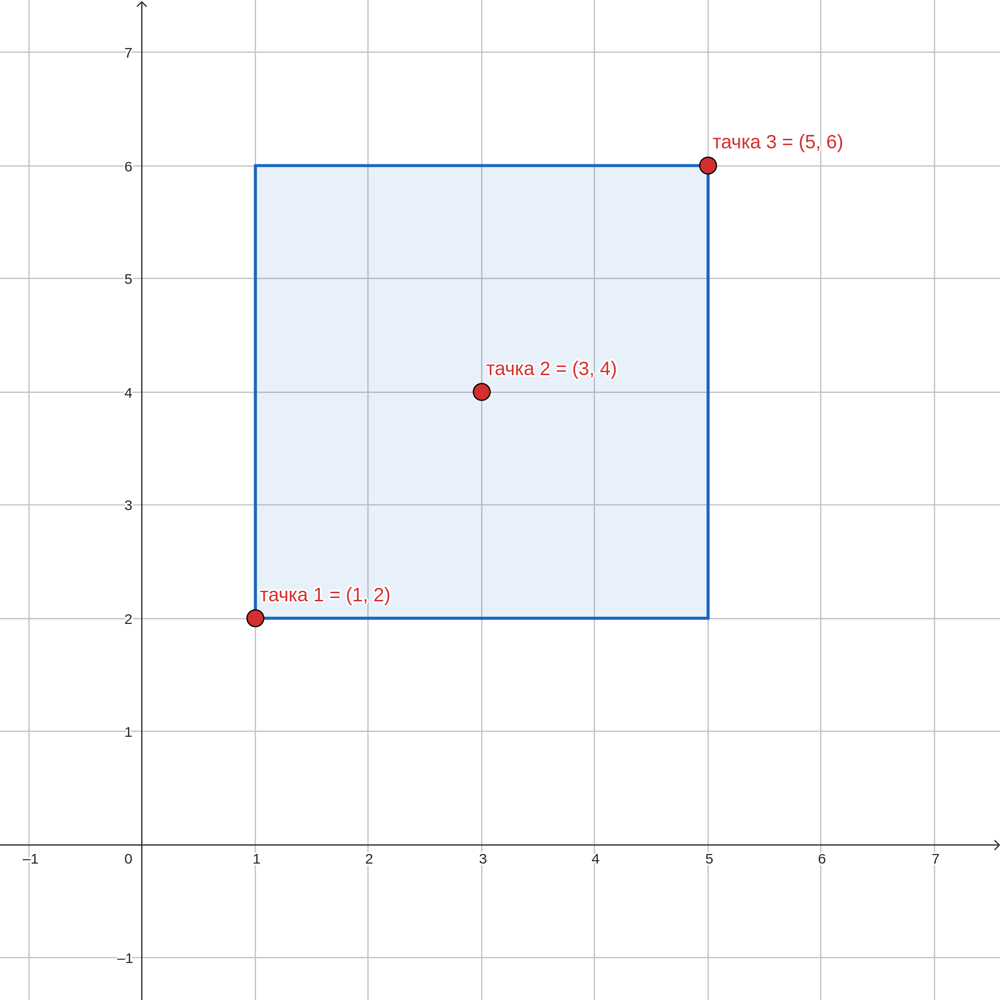

# 1 - Nadkvadrat


	
| Vremensko ograničenje | Memorijsko ograničenje |
|:-:|:-:|
| 100ms | 32MB |
	
Dobro je poznato (još od 1888. godine i Ničeovog dela Sumrak idola) da *ono što nas ne ubije - to nas ojača*. Tako je i sa tačkama, kvadratima, takmičarima, pa i samom komisijom... Ako već ne može da kao ranije organizuje tri kruga kvalifikacija, komisija može zadati tri tajna broja (videti prošli krug) i tri javne tačke u ravni (gledate ih upravo). Ako već tačno tri godine, još od doba poslednje pandemije (i drugog kruga kvalifikacija školske 2020/2021. godine), niko i dalje ne pita *kako je kvadrat?*, a on preživi, postaće nadkvadrat (nem. *Überquadrat*) i obuhvatiće sve tri javno zadate tačke!
	
Naime komisija je zadala tačno tri tačke u Dekartovom pravouglom koordinatnom sistemu u ravni definisane celobrojnim koordinatama $(x_1, y_1)$, $(x_2, y_2)$ i $(x_3, y_3)$. Vaš zadatak je da pronađete površinu najmanjeg kvadrata sa stranicama paralelnim koordinatnim osama koji ih sadrži, odnosno obuhvata sve tri zadate tačke!
	
## Opis ulaza
	
U prva i jedina tri reda standardnog ulaza nalaze se celobrojne koordinate tačaka i to: u prvom redu $(x_1, y_1)$, u drugom redu $(x_2, y_2)$ i u trećem redu $(x_3, y_3)$. U svakom redu koordinate $x$ i $y$ su razdvojene razmakom.
	
## Opis izlaza
	
U prvom i jedinom redu standardnog izlaza, ispisati površinu najmanjeg kvadrata sa stranicama paralelnim koordinatnim osama, odnosno pravama $x=0$ i $y=0$, koji obuhvata tri zadate tačke.
	
## Primer 1
	
### Ulaz
	
```
	1 2
	3 3
	2 1
```
	
### Izlaz
	
```
	4
```
	
### Objašnjenje
	
Tri tačke koje su zadate mogu se obuhvatiti kvadratom čije će donje levo teme biti u koordinati $(1, 1)$, a gornje desno teme u koordinati $(3, 3)$ te je njegova površina $2^2=4$.


	
## Primer 2
	
### Ulaz
	
```
	1 1
	-2 -1
	3 -2
```
	
### Izlaz
	
```
	25
```
	
### Objašnjenje
	
Tri tačke koje su zadate mogu se obuhvatiti kvadratom čije će donje levo teme biti u koordinati $(-2, -3)$, a gornje desno teme u koordinati $(3, 2)$ te je njegova površina $5^2=25$.


	
## Primer 3
	
### Ulaz
	
```
	1 2
	3 4
	5 6
```
	
### Izlaz
	
```
	16
```
	
### Objašnjenje
	
Tri tačke koje su zadate mogu se obuhvatiti kvadratom čije će donje levo teme biti baš u koordinati $(1, 2)$, što je zapravo prvozadata tačka, a gornje desno teme u koordinati $(5, 6)$, što je trećezadata tačka, te je njegova površina $4^2=16$.


	
## Ograničenja
	
$-10^9 \leq x_1, x_2, x_3, y_1, y_2, y_3 \leq 10^9$
	
Test primeri su podeljeni u četiri disjunktna skupa:
	
* U testovima vrednim 30 poena: koordinate su nenegativne $0 \leq x_1, x_2, x_3, y_1, y_2, y_3 \leq 10^4$
* U testovima vrednim 30 poena: $-10^4 \leq x_1, x_2, x_3, y_1, y_2, y_3 \leq 10^4$
* U testovima vrednim 30 poena: tri tačke su još i kolinearne
* U testovima vrednim 10 poena: Bez dodatnih ograničenja.
	
## Napomena
	
Smatrati da kvadrat obuhvata, odnosno sadrži tačku čak i ako se ona nalazi na njegovoj stranici ili u temenu.
	
Rešenje
	
| Autor | Tekst i test primeri | Analiza rеšenja | Testiranje |
|:-:|:-:|:-:|:-:|
| Vladimir Milovanović | Vladimir Milovanović | Vladimir Milovanović | Aleksandar Višnjić |
	
## Glavno rešenje
	
Za rešenje zadatka dovoljno je pronaći masimum i minimum po svakoj koordinati od tri zadate tačke, a zatim kvadrirati veću od razlika dveju koordinata. Drugim rečima, ako su tri tačke u Dekartovom koordinatnom sistemu zadate koordinatama $(x_1, y_1)$, $(x_2, y_2)$ i $(x_3, y_3)$, tada je najpre neophodno pronaći $x_\max = \max(x_1, x_2, x_3)$ i $x_\min = \min(x_1, x_2, x_3)$, te $y_\max = \max(y_1, y_2, y_3)$ i $y_\min = \min(y_1, y_2, y_3)$. Da se u zadatku tražila površina minimalnog obuhvatajućeg *pravougaonika*, onda bi dužine stranica tog pravougaonika bile $\Delta x = x_\max - x_\min$ i $\Delta y = y_\max - y_\min$. Međutim, s obzirom da se traži površina minimalnog obuhvatajućeg *kvadrata*, to je stranica kvadrata zapravo $\max(\Delta x, \Delta y)$, a površina tog kvadrata $(\max(\Delta x, \Delta y))^2$ do čega se dolazi u konstantnoj vremenskoj i prostornoj složenosti $\mathcal{O}(1)$. Za sve poene (poslednji podzadatak) bilo je neophodno primetiti implementacijski detalj da kvadriranjem neke velike vrednosti može doći do prekoračenja, pa je u programskom jeziku *C* rezultat neophodno smestiti u neki dovoljno veliki ceo broj (konkretno `long long` u ovom slučaju).
	
Da je umesto tri, u opštijem slučaju bilo zadato $N$ tačaka u prostoru, mogao bi se primeniti identičan algoritam, a njegova složenost bila bi $\mathcal{O}(N)$, to jest linearna po broju zadatih tačaka čije se obuhvatanje kvadratom traži.
	
``` cpp title="01_nadkvadrat.cpp" linenums="1"
	#include <bits/stdc++.h>
	
	using namespace std;
	
	int main()
	{
	    vector<int> x(3);
	    vector<int> y(3);
	
	    for (int i=0;i<3;i++) cin>>x[i]>>y[i];
	
	    sort(x.begin(),x.end());
	    sort(y.begin(),y.end());
	    int len=max(x[2]-x[0],y[2]-y[0]);
	    cout<<(long long)len*len;
	}

```
